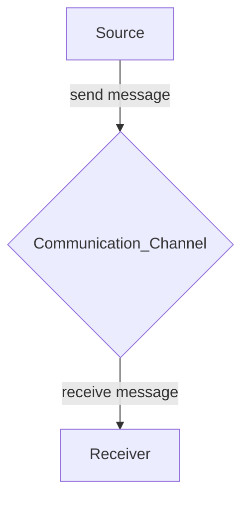

# [Entropy (wikipedia)](https://en.wikipedia.org/wiki/Entropy_(information_theory))
Information Entropy: (also called Shannon Entropy) - consists of three parts of a data communication system:

Entropy is the absolute mathematical limit on losslessly compressed. 
**Entropy**: is the average level of uncertainty or information associated with a random variable's potential states or outcomes. 
### ID3 - 
$$
H(\mathcal{S}) = \sum_{x \in \mathcal{X}} -p(x) \, \log_{2} p(x)
$$

S = current dataset calculating entropy on
X = the set of classes in S
p(x) = the probability/proportion of number of elements in class x in set S

Entropy is calculated for all attributes, smallest entropy score is used to split the set S on the iteration. 

### Information Content rate 
increases as probability of p(E) decreases. When P(E) is close to 1, the suprisal of the event is low, but if p(E) is close to 0, the surpisal is high. 
$$
\log\left(\frac{1}{\mathcal{p}(E)}\right)
$$
if p = 0 then there is no information or uncertainty. 
