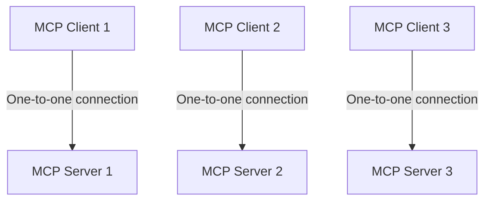

[source](https://modelcontextprotocol.io/docs/getting-started/intro)
# What is the Model Context Protocol (MCP)?
- open source standard
- connects AI applications to external systems
- Can connect an LLM to a data source (such as db), tools, etc, and access key info and do tasks
![[Pasted image 20251029195911.png]]
## What can MCP enable?
- agents can access your google calendar and notion
- generate web app using figma
## Why does MCP matter?
- can reduce development time
- enhance apps and user experience
# Architecture Overview
## Scope
- **MCP Specification**: specification for MPC
- **SDK**s: SDKs for programming languages to implement the MCP
- **MCP Development Tools**: tools for development
- **MCP Reference Server Implementations**: Reference implementation of MCP servers
## Concepts of MCP
### Participants
- follows a client-server model. 
	- MCP host - the LLM
	- MCP Client - component that connects to MCP server and gets context for MCP host
	- MCP Server - Program that provides context to client
Example: VS Code (Host), connects to Sentry MCP Server (server)

**server** is the name for the program, regardless of runtime (local/remote). 
### Layers
Consists of 2 layers:
1) Data Layer: defines the json-rpc protocol for client-server communication
2) Transport layer: Defines the communication and channels for data exchange between client and server
#### Data Layer
includes:
- Lifecycle management: handles connection initialization, capability negotiation, and connection termination 
- Server Features: tools for AI actions, context data, prompts for interaction templates
- Client features: enables servers to ask client to sample from host LLM, elicit input from user, log messages to client
- utility features: notifications etc
#### Transport Layer
Handles communication/authentication between clients and servers. 
Transport mechanisms:
- Stdio transport: uses i/o stream for direct process communication between local processes on same machine
- Streamable HTTP transport: Uses HTTP POST for clinet-to-server messages with optional Server-Sent Events for streaming capabilities. This transport enables rmeote server communication. Supports HTTP standard authentication methods
#### Data Layer Protocol
Uses [[JSON-RPC 2.0]] for RPC protocol. 
##### Lifecycle management
MCP is stateful protocol, requires lifecycle management. 
##### Primitives
Three core primitives that a server can expose:
1) tools: executable functions that ai apps can invoke to perform actions
2) resources: data sources that give context to AI apps
3) prompts: reusable templates that help structure interactions with language models
Each primitive has associated methods for discovery, retrieval, sometimes execution. The `*/list` method is used to discover available primitives. 

Primitives that the client can expose:
1) sampling: allows servers to request language model completions from the client's AI application. 
2) Elicitation: allows servers to request additional information from users.
3) Logging: enables servers to send log messages to clients for debugging and monitoring purposes. 

##### Notifications
the protocol supports real time notifications to enable dynamic updates between servers and clients. e.g. server tools change (new features added etc). 

### Example: 
1) `initialize` handshake to establish connection and negotiate supported features. 
Request:
```json
{
  "jsonrpc": "2.0",
  "id": 1,
  "method": "initialize",
  "params": {
    "protocolVersion": "2025-06-18",
    "capabilities": {
      "elicitation": {}
    },
    "clientInfo": {
      "name": "example-client",
      "version": "1.0.0"
    }
  }
}
```
Response:
```json
{
  "jsonrpc": "2.0",
  "id": 1,
  "result": {
    "protocolVersion": "2025-06-18",
    "capabilities": {
      "tools": {
        "listChanged": true
      },
      "resources": {}
    },
    "serverInfo": {
      "name": "example-server",
      "version": "1.0.0"
    }
  }
}
```
After handshake client notifies readiness:
```json
{
  "jsonrpc": "2.0",
  "method": "notifications/initialized"
}
```
2) Tool discovered - get the list of tools available from server
3) Tool execution (primitives) - client now able to execute tools
4) Real-time updates (notifications) - notifications allow server to inform clients about changes without receiving a request. Why this matters:
	1) dynamic environment: tools may come and go based on server state ect
	2) efficiency: clients don't need to poll for changes
	3) consistency: ensures clients always have accurate info about server capabilities 
	4) real-time collaboration: makes ai apps responsive and adaptive to changing contexts
# Understanding MCP servers
MCP servers expose specific capabilities to AI applications through standardized protocol interfaces.
- file system servers
- database servers
- GitHub servers 
- Slack server
- calendar server
## Core Server Features

| Feature   | Explanation                                                                       | Examples                                      | Who Controls It |
| --------- | --------------------------------------------------------------------------------- | --------------------------------------------- | --------------- |
| Tools     | functions that LLM can call and use                                               | Search, Send mesasges, create calendar events | Model           |
| Resources | Passive data source, read-only access, such as files or db schemas                | retrieve documents access knowledge bases     | application     |
| Prompts   | pre-built instruction templates to tell model what to do with tools and resources | plan vacation,                                | user            |
### Tools
Tools allow ai models to perform actions. Each tool defines specific operation. 
#### How Tools Work
Tools are schema-defined. They are interfaces LLM can invoke. Uses the JSON schema for validation. 
- may require user consent prior to execution
##### Protocol Operations:

| Method       | Purpose                  | Returns                   |
| ------------ | ------------------------ | ------------------------- |
| `tools/list` | Discover available tools | array of tool definitions |
| `tools/call` | Execute specific tool    | tool execution result     |
##### Example of TooL Definition:
```json
{
  name: "searchFlights",
  description: "Search for available flights",
  inputSchema: {
    type: "object",
    properties: {
      origin: { type: "string", description: "Departure city" },
      destination: { type: "string", description: "Arrival city" },
      date: { type: "string", format: "date", description: "Travel date" }
    },
    required: ["origin", "destination", "date"]
  }
}
```
##### Example: Travel Booking:
Tools enable AI apps to perform actions on user's behalf. 
###### Flight Search
`searchFlights(origin: "NYC", destination: "Barcelona", date: "2024-06-15")`

### User Interaction Model
Tools are **model** controlled. But they are on guard rails. user controls can be implemented through:
- displaying tools in UI, so users can define tool availability
- approval dialogs for individual tools
- permission sesttings for pre-approving operations
- activity logs to show all tool execution
#### Resources
provide structured access to information for AI apps
##### How resources work

https://modelcontextprotocol.io/docs/learn/server-concepts