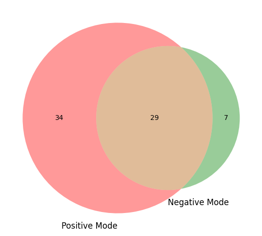

  

<strong>UNIVERSITY OF FRIBOURG</strong>

<strong>COMMONS LAB</strong>

<strong>DEPARTMENT OF BIOLOGY</strong>

  

<h1 align="center">
Geophytes collection, comparison of extraction solvents  
and modeling of data loss in mass spectrometry
</h1>

  

<em>Author :</em> <strong style="color:#800000">Jade Dandois</strong>&nbsp;&nbsp;&nbsp;&nbsp;&nbsp;&nbsp;&nbsp;&nbsp;<em>Supervisor :</em> <strong style="color:#800000">Dr. Pierre–Marie Allard</strong>

  

<strong>Submitted in fulfillment of the requirements for the Bachelor's degree.</strong>

<strong>June 27th, 2025</strong>

# Acknowledgements 

I would like to extend my heartfelt thanks to Pierre-Marie Allard, my supervisor during these three months of academic work. I am deeply grateful for his unwavering dedication, his genuine interest in this remarkable project, and the invaluable guidance he has provided throughout. I hold great admiration for both his work and the inspiring project he initiated and continues to nurture with such commitment.

Thank you to the entire COMMONS LAB team. My warm thanks go to Héloïse Coen, who greatly supported me during the collection of geophytes and extraction processes—your help and our shared moments of collaboration were truly appreciated. Edouard Brülhart, thank you for patiently introducing me to the sampling techniques and the functioning of the laboratory. Colin Volet, for your guidance with the technical aspects of mass spectrometry, your expertise was essential. And finally, Marco Visani, for your remarkable patience and guidance in bioinformatics—thanks to you, I was able to significantly deepen my understanding of coding, an invaluable tool for the work I was entrusted with.

# Abstract 

At a time when the molecular diversity and metabolomic references of living organisms remain largely under-characterized—despite being essential for understanding biodiversity and developing conservation strategies grounded in molecular evidence—existing databases are often fragmented, focused on model organisms or biomedical applications, and poorly suited to large-scale interdisciplinary and ecosystem-level integration. In this context, open initiatives such as LOTUS have emerged, aiming to reference, standardize, and interlink molecule–organism pairs via Wikidata, thereby making chemical knowledge of life more accessible, interoperable, and reusable. Aligned with this vision, the Earth Metabolome Initiative (EMI) sets out to map the entirety of Earth’s metabolome by generating molecular profiles for every known species. My Bachelor’s thesis contributes to this effort through three complementary axis: (1) the collection and metabolomic profiling of geophyte species from the Botanical Garden of Fribourg, as part of the Digital Botanical Gardens pilot initiative; (2) the evaluation of alternative extraction solvents, notably DMSO, to improve compatibility with downstream biological assays; and (3) the modeling of analytical data loss in mass spectrometry using a “fake extract” composed of reference metabolites. 
By improving some of the key elements of existing workflows and, through the “false extract” project, laying the foundations for anticipating analytical losses in mass spectrometry, this work has helped to initiate a more accurate representation of the chemistry of natural extracts, as well as improving the reuse of extracts for the discovery of new bioactive compounds.

# Introduction 

A large number of databases are currently available to the public for biological elements such as proteins (UniProt, https://www.uniprot.org), RNA (Rfam, https://rfam.org/), DNA (NCBI GenBank, https://www.ncbi.nlm.nih.gov/genbank/) or genomes (Ensembl, https://www.ensembl.org/). 

However, some of the databases currently available for metabolomics remain quite limited , focusing mainly on specific types of organism, such as humans (HMDB, https://www.hmdb.ca), for medical purposes and centered on known metabolites, or simply on raw analytical data (MassBank, https://massbank.eu/MassBank/). Another accessible database in metabolomics is the Global Natural Products Social Molecular Networking ([GNPS](https://gnps.ucsd.edu/ProteoSAFe/static/gnps-splash.jsp?redirect=auth)), a collaborative platform for the processing and analysis of mass spectrometry data. GNPS includes both known metabolites and unknown metabolomic profiles. <a href="#ref1" id="note1">1</a>

Natural products (NPs), defined as any chemical entity found in a living organism, are the focus of the open, interoperable, and interdisciplinary database [LOTUS](https://lotus.naturalproducts.net/), which is continuously expanding. To meet the goals of an open-source project for the research, storage, and sharing of data on natural products and their source organisms, the data are centralized on [Wikidata](https://www.wikidata.org/wiki/Wikidata:Main_Page). LOTUS serves as a reference resource, comprising over 750,000 referenced structure-organism pairs, standardized at the chemical (structure), biological (organism), and bibliographic (reference) levels. The project is fully aligned with open science principles and adheres to the FAIR guidelines (Findable, Accessible, Interoperable, Reusable) to promote data reuse and integration by the scientific community. <a href="#ref2" id="note2">2</a>

The [Earth Metabolome Initiative](https://www.earthmetabolome.org/) (EMI) consortium, conceived in 2022 and formally launched in 2024 by Pierre-Marie Allard and Emmanuel Defossez, is a collective open science endeavor aimed at addressing the critical lack of comprehensive metabolomic data for the species of our planet. The initiative set out to build a knowledge graph designed to gather the full spectrum of metabolites across all known living species—approximately 2.3 million—thus encompassing the entirety of life, from microbes to mammals, within an integrated and ecosystem-level perspective. Unlike existing databases, EMI stands out for its clear ambition to cover the full diversity of life across all kingdoms on a global scale. It focuses on the analysis of unknown metabolomic profiles from Earth’s organisms, while aiming to address gaps observed in existing resources such as GNPS, Massbank or HMDB. In particular, EMI sets itself apart by explicitly recovering detailed metadata associated with the profiled organisms—an aspect that remains a notable limitation in GNPS.<a href="#ref3" id="note3">3</a>

## Earth Metabolome Initiative 

As mentioned above, the EMI consortium is an open science initiative with a global scope, whose aim is to draw up metabolomic profiles of all known species on this planet, with 3 main objectives, which are the protection of biodiversity, the benefit to human society and a deeper understanding of the chemical foundations of the biosphere. <a href="#ref3" id="note3">3</a>

Biodiversity is currently facing an unprecedented crisis, primarily driven by the intensification of human activities over the past century. This decline has accelerated dramatically in recent decades. Alarmingly, the current rate of species extinction is estimated to be at least 100 times higher than the natural background rate, underscoring the severity of human impact on the planet's ecosystems. <a href="#ref4" id="note4">4</a> 
In this context, acquiring comprehensive metabolic data becomes critically important. Such data can provide molecular-level insights into ecosystem functioning and the roles of natural products within them. By deepening our understanding of molecular diversity and its ecological relevance, we can develop informed strategies for conserving biodiversity and sustaining the natural resources upon which human well-being depends.

Establishing a comprehensive, publicly accessible database of species-specific metabolomic profiles is of paramount importance for advancing research across generations. Such a resource will provide open access to molecular-level data, facilitating a wide spectrum of scientific inquiry—from fundamental biological and biomedical research to the discovery of novel bioactive compounds and innovations in agri-food systems. By enabling a deeper understanding of natural metabolites that underpin ecosystem dynamics, nutritional quality, and agricultural resilience, this database will serve as a critical foundation for interdisciplinary efforts aimed at sustaining both human health and environmental integrity.

The establishment of a global metabolomic map by the Earth Metabolome Initiative (EMI) will also enable the integration of existing biological datasets with newly generated molecular data. This will facilitate the development of novel insights, such as evolutionary models of the metabolome, and may even allow for the prediction of the chemistry of yet-undiscovered organisms by identifying specific natural product patterns linked to molecular and ecological contexts.

This project is highly ambitious, and although a significant amount of data has already been collected, the establishment of a global metabolomic database is likely to take decades to fully materialize. For this reason, several pilot projects have been initiated to test data acquisition methodologies and to focus on specific components of the broader initiative, avoiding unnecessary dispersion.

Three of these EMI pilot projects formed the core of my bachelor's thesis and were specifically designed to address key objectives of the Earth Metabolome Initiative.

The first project falls within the scope of the [Digital Botanical Gardens Initiative](https://www.dbgi.org), a botanical-scale precursor to EMI, in which I participated by collecting samples from the geophyte section of the Fribourg Botanical Garden. The second project aimed to refine our extraction methods by comparing the currently used methanol-based solvent with dimethyl sulfoxide (DMSO), thereby improving the biocompatibility of our extracts for subsequent bioassays. The third project is part of the PhD research of Marco Visani and focuses on modeling molecular data loss in mass spectrometry, with the goal of predicting the chemistry of living organisms based on unknown natural extracts, aligned with [EMI](https://www.earthmetabolome.org/) and [LOTUS](https://lotus.naturalproducts.net/) objectives. 

## Digital Botanical Gardens Initiative 

The Earth Metabolome Initiative (EMI) is a globally oriented project, and as such, required the development of a pilot version—a scaled-down implementation designed to be applied to nearby, easily accessible, and manipulable living organisms. The Digital Botanical Gardens Initiative was conceived precisely with this objective in mind. 

The initiative aims to digitize the chemical diversity of Swiss botanical gardens by creating extract libraries, analyzing them via mass spectrometry, and organizing the data into accessible, interoperable knowledge systems. It also seeks to develop scalable workflows and provide molecular insights to support biodiversity conservation and open science. 
These aspects of DGBI are fundamental for ensuring reproducibility of laboratory processes and facilitating automatisation, both of which are critical for the large-scale EMI project, which will handle millions of samples.

Swiss botanical gardens offer several key advantages for this pilot, foremost among them the remarkable diversity of plant species they host, as well as the ease of sampling. 

The [Fribourg Botanical Garden](http://www.unifr.ch/jardin-botanique/fr/), on which I focused my fieldwork, cultivates and conserves approximately 5,000 species, providing a rich and well-documented resource for metabolomic studies. Its location on the University of Fribourg campus is particularly advantageous, offering immediate proximity to laboratories for subsequent analytical work. Moreover, the plants are especially suited for experimental research: they are stationary, easily accessible, available in sufficient quantity for sampling, and can be revisited repeatedly for collections from the same individuals or specific locations when necessary.

While the plants are cultivated rather than growing in their natural habitats—an aspect that may slightly influence their metabolic profiles—the primary objective here is not ecological fidelity, but rather the establishment of a solid reference framework. The garden setting provides an ideal platform for testing physical and bioinformatic tools involved in building a curated chemical library, and for evaluating the feasibility of a large-scale digitization project.

# Collection of Geophytes - Digital Botanical Gardens Initiative 

The current data from the Botanical Garden of the University of Fribourg record 1,679 collected plant species (42.7%), 1,250 species extracted beyond the core collection (31.8%), and 691 species for which metabolomic profiles have been generated (17.6%) https://emi-collection.unifr.ch/. While the garden conserves approximately 5,000 individual plants, these represent around 4,000 distinct species, as some are present in multiple specimens.

The harvest from the geophyte section proved particularly relevant, as this sector had not yet been covered by DGBI. Moreover, collecting additional data from this group contributed meaningfully to the advancement of the project.

Geophytes are perennial plants that exhibit resilience to both severe drought and extreme cold, primarily due to nutrient reserves stored in their underground organs (tubers, bulbs, rhizomes). These reserves enable them to enter a dormant state and persist in the soil until environmental conditions become favorable for growth. <a href="#ref5" id="note5">5</a>

*Figure 1 – Map of Fribourg botanical garden. The location of the geophyte sector is indicated by point number 10*

Several plant families were collected, including Amaryllidaceae, Liliaceae, Iridaceae and many others, enabling metabolomic patterns to be drawn up for these families, and for all geophyte-type plants.

With the help of Héloïse Coen, 185 samples were collected (including leaves and flowers samples) from 150 species. 128 species remain to be collected (46%), meaning that a substantial portion of the target species has already been covered for this part of the project. 

Below are the respective lists of samples collected by myself and Héloïse Coen, as well as the complete list of species in the geophyte section of the Fribourg Botanical Garden. 
[Geophytes collected by Jade Dandois](https://github.com/jade147/jade_bachelor_work_repo/blob/a4491cbe601b38fbaab3b5437008505f01ea06e1/field_data_trimmed.csv)
[Geophytes collected by Heloïse Coen](https://github.com/jade147/jade_bachelor_work_repo/blob/fe70e103e4634caacbb3a798a4f7b7fe4c3beaef/Field_Data%2020250618-12257.csv)
[Complete list of geophytes](https://github.com/jade147/jade_bachelor_work_repo/blob/fe70e103e4634caacbb3a798a4f7b7fe4c3beaef/geophytes_extrait.csv)

To cover this sector, a dedicated protocol for sample collection, extraction, and analysis was required.

## Materials and methods

### Collect 

The standard DBGI sampling protocol was followed throughout the collection process. Leaf or flower tissues were directly sampled from the target individual. Each specimen was placed in a coffee filter paper, inserted into a pre-labelled Falcon tube, and immediately flash-frozen in liquid nitrogen at -196 °C. Samples remained in liquid nitrogen until the end of the field session, after which they were stored at -80 °C pending lyophilization.

Each Falcon tube was pre-labelled with a unique QR code that links the sample to its associated metadata, selected via the QField application (https://qfield.org). For every collected sample, a georeferenced point was recorded on the QField map, accompanied by key identification data including precise location, taxon name, sample ID (matching the QR code), and a set of at least five descriptive photographs: (1) the species identification label, (2) the labelled Falcon tube next to the identification label, (3) a general view of the plant, (4) a close-up of key morphological features, and (5) a photo of the cutting site with the scalpel in place.

The QR code–linked identification key plays a critical role, providing a unique identifier for each sample and enabling efficient tracking of its metadata across all steps of the workflow—from collection to extraction and analysis. At each successive stage, the same QR code is transferred onto the resulting tube, with newly generated metadata—such as extracted weight, number of extractions, or storage container—systematically appended to the sample’s record.

### Extraction

Samples retrieved from the freezer were placed in a freeze-dryer for 72 hours. After lyophilization, they were transferred into Falcon tubes sealed with non-perforated caps. A mass of 50 milligrams of dried sample was weighed out, allowing for a tolerance of ±5% (±2.5 milligrams), and placed into 2 milliliters round-bottom Eppendorf tubes. Three 4 mm stainless steel beads were added to each tube to facilitate grinding of the extract. The remaining material was returned to its original Falcon tube and stored in a labeled container.

The weighed samples were ground using a Retsch shaker for 2.5 minutes at 25 Hz. Subsequently, 1.5 milliliters of the DGBI extraction solvent—composed of 80% methanol, 20% distilled water, and 0.1% formic acid—was added to each powdered sample. The tubes were shaken again in the Retsch machine under the same conditions (2.5 minutes at 25 Hz). Following this, the samples were centrifuged for 2 minutes at 13,000 RPM to separate the supernatant from residual plant debris. The supernatant was carefully collected and transferred into labeled vials (2 milliliters) equipped with hermetically sealed caps. These vials were then stored in labeled containers and kept at –80°C until further analysis.

### Aliquoting and analysis in mass spectrometry 

From the previously prepared vials, 120 microlitres of liquid extract were transferred into new vials equipped with inserts to create aliquots. The vials were carefully sealed using slipped caps. The resulting aliquots were then subjected to liquid chromatography–mass spectrometry (LC-MS), and the spectra were analyzed using appropriate tools and software (further details are provided in the subsequent sections of the project).

### Untargeted mass spectrometry 

Untargeted mass spectrometry was used, as we did not know the contents of the extract in advance. Therefore, no specific molecules were targeted. The aim was to analyze as many compounds as possible in the extract and recover as much data as possible.

Samples were first analyzed using High-Performance Liquid Chromatography (HPLC), which separates components based on their polarity and hydrophobicity, employing a non-polar stationary phase and a polar mobile phase. The separated molecules then undergo ionization via electrospray ionization (ESI) in either positive or negative mode, before being detected by an Orbitrap mass spectrometer, offering high mass resolution and accuracy. All molecules are initially detected in MS1, followed by data-dependent acquisition (DDA) where the most intense ions are fragmented in MS2 to generate fragmentation spectra for molecular identification.<a href="#ref6" id="note6">6</a>

*Figure 2 : Schematic representation of the sample analysis workflow using mass spectrometry.*
*The process includes separation via High-Performance Liquid Chromatography (HPLC), ionization and detection using an Orbitrap high-resolution mass analyzer, followed by Data-Dependent Acquisition (DDA) for MS/MS fragmentation. The diagram was created using MZmine, with parameters configured through the integrated mWizard assistant.* 

### Inaturalist 

Photographs associated with each collected species, taken during the field collection process, are uploaded to the iNaturalist platform (https://www.inaturalist.org/). This allows the iNaturalist community—including taxonomic experts—to verify species identities based on detailed images, and provides an opportunity to revise any incorrect or incomplete identifications. In turn, the community also benefits from these data, contributing to the ongoing expansion of the iNaturalist database. [The following map delineates the geographic range corresponding to the geolocated geophyte observations recorded on iNaturalist.](https://www.inaturalist.org/observations?nelat=46.79293526196035&nelng=7.156343175796218&subview=map&swlat=46.792731427890715&swlng=7.155914022353835&user_id=dbgi&verifiable=any)

## Conclusion 

I was therefore able to contribute to the progress of the DGBI pilot by collecting a number of samples from the geophyte sector. Although 46% of this sector still remains to be sampled, metabolomic profiles can already be generated for many of the collected species, with more to follow once sampling is complete. This may eventually enable the identification of metabolomic patterns specific to geophyte plants, and help uncover links or characteristic natural product signatures within certain plant families.
 
## Perspectives 

The initial objective of the Swiss Digital Botanical Gardens Initiative (DGBI) was to establish metabolomic profiles of plant species growing in Swiss botanical gardens. To this end, species from the [Botanical Garden of Fribourg](https://www.unifr.ch/jardin-botanique/fr/) were first collected. Since then, several other botanical gardens in Switzerland have expressed interest in participating in the initiative, including the [Botanical Garden of Neuchâtel](https://www.jbneuchatel.ch)—where a number of species have already been sampled ([more details below](#progress-of-the-neuchâtel-botanical-garden-collection))—as well as the [Conservatory and Botanical Garden of Geneva](https://www.cjbg.ch/) and the [Alpine Botanical Garden Flore-Alpe in Champex-Lac](https://www.flore-alpe.ch/fr/).

Although DGBI began in Switzerland, the project is designed to expand internationally. It will remain open as an open science database, not solely as an EMI pilot project. The initiative has already started extending beyond Switzerland, notably with the involvement of the [Royal Botanic Gardens, Kew](https://www.kew.org)—a significant development, given that Kew holds around 68,000 specimens representing approximately 18,000 species.

### Progress of the Neuchâtel botanical garden collection

Regarding the Neuchâtel Botanical Garden, a few figures can be mentioned. Currently 1,300 samples have been collected, of which 880 have been matched with the botanical garden's database. This has made it possible to link them to their IPEN (International Plant Exchange Network) codes.

According to the database, the garden contains approximately 2,600 different plant species. At first glance, this may suggest a significant gap ; however, many of these plants are still under cultivation (in greenhouses or outdoors) and are therefore too small to be sampled. Others are not yet labeled, which also complicates the sampling process.

Several of the diagrams below illustrate the situation of the Neuchâtel Botanic Garden in terms of diversity and in comparison with global diversity.

*Figure 3 : Location and organization of plant species in the Neuchâtel Botanical Garden. Each point represents a georeferenced individual plant, colored according to the garden zone to which it belongs.*

*Figure 4 : Barplot showing the Neuchâtel garden's coverage of families, genus and species in relation to global diversity*

*Figure 5 : Phylogenetic tree of plant families available at the Neuchâtel Botanic Garden*

*Figure 6 : Whittaker diagram illustrating the environmental coverage of plant species sampled at the Neuchâtel Botanical Garden.*

# DMSO Project 

## Actual DBGI extraction and issues 

As outlined in the [introduction](#introduction), DGBI is a recent pilot project, one of whose objectives is to evaluate and refine current collection and extraction methodologies, with the aim of improving them where necessary.

One of the long-term objectives of both EMI and DGBI is to generate libraries of molecules obtained through sample extractions, with the aim of enabling their reuse and distribution to other laboratories for further bioanalysis, including high-throughput biological screening.

High-throughput screening (HTS) enables the automated testing of compound libraries to assess their activity against various biological targets. HTS is now extensively used in drug discovery, medical diagnostics, stem cell research, and genetic studies<a href="#ref7" id="note7">7</a>.

The extraction mixture currently used as a solvent for molecule extraction in the DGBI project consists of 80% methanol, 20% distilled water, and 0.1% formic acid, for a total volume of 200 mL. This composition has proven to be highly effective in extracting metabolites from our samples. However, the solvent currently used in the DGBI project for samples extraction is not compatible with downstream analyses in biological or biochemical laboratories, as methanol can damage cells and formic acid can inhibit enzymatic reactions.

## An alternative to methanol-based extraction 

Another solvent currently widely used in biology laboratories is dimethyl sulfoxide (DMSO), a highly stable, soluble, polar, aprotic, and low-toxicity compound, compatible with biological systems<a href="#ref8" id="note8">8</a>. These properties make DMSO an excellent solvent for biological applications.

Within this context, an additional pilot study was conducted to explore potential enhancements to both the extraction protocol and the solvent used. Specifically, three extraction methods were tested and compared to address the following question: is the extraction method using dimethyl sulfoxide (DMSO) as effective as the methanol-based protocol for recovering our target metabolites?

This study therefore aims to assess whether DMSO could serve as a suitable alternative to the current extraction mixture. If the results prove promising and DMSO performs as effectively as the methanol–water–formic acid mixture in extracting target molecules, it could be adopted in future protocols—thus enabling the reuse of extracted samples for pharmacological research purposes.

## Material and methods 

The [standard DBGI extraction protocol](#extraction) described above was followed for this pilot study, with the exception of the extraction solvent, which was modified for comparative purposes.

In this experiment, six well-documented plant samples (*Valeriana officinalis*, *Echinacea purpurea*, *Cannabis sativa*, *Erythroxylum coca*, *Salvia officinalis*, and *Nicotiana tabacum*) were tested using three extraction methods: the standard DBGI protocol with its usual solvent (80% methanol, 20% distilled water, 0.1% formic acid), a pure DMSO extraction (99.8%), and a DMSO extraction followed by sonication (5 minutes of high-frequency sound wave pulses generating bubbles that promote cell lysis).<a href="#ref9" id="note9">9</a>

For each method, one Eppendorf tube was prepared per sample. Two blanks were also included in the experiment, using the methanol-water-formic acid mixture and pure DMSO, respectively.

*Figure 7 : Eppendorf tubes after centrifugation with supernatant ready for recovery. The 6 samples per extraction method (A, B, C) are shown. A: Methanol-water-formic acid extraction method; B: Simple DMSO extraction; C: DMSO extraction with sonication.* 

The resulting 20 samples were then transferred to vials for mass spectrometry and subsequent analysis.

### Evaluation of extractions

The files generated from mass spectrometry analysis of the samples were processed using MZmine for the interpretation of the resulting chromatograms, applying the [following mzBatch configuration](https://github.com/digital-botanical-gardens-initiative/dmso-meoh-extraction-evaluation/blob/9d98ba18332c9316a3f8d11c8f3bf25549dc62b8/docs/mapp_project_00067/mapp_batch_00173/results/mzmine/mapp_batch_00173_maclocal.mzbatch)

## Results 

### Principal Component Analysis 

As a first step, a Principal Component Analysis (PCA) was performed to reduce the dimensionality of the dataset and to explore the main sources of variance among the samples.

*Figure 8 : PC1 (x-axis) accounts for 31.8% of the total variance in the dataset, while PC2 (y-axis) explains 15.5%. Each point represents one of the three methods applied to each of the six samples, with one color per species.* 

### Chromatograms analysis

As previously mentioned, the chromatograms of the samples tested using the three different methods were analyzed. However, given that the sonicated DMSO method did not yield significantly improved results compared to the simple DMSO extraction, only the chromatograms obtained from the methanol–water and simple DMSO methods are presented here for clarity.

Chromatographic profiles of extracts from the six species, obtained using methanol–water and DMSO extraction methods (represented by two colors), are superimposed to compare signal intensities and metabolic patterns as a function of retention time. The annotated peaks correspond to the majority compounds detected. 
For each species, data from both positive and negative ionization modes are displayed. A single blank chromatogram is included for each ionization mode, serving as a reference for both extraction methods. 
The annotated peaks correspond to the majority compounds detected. 

*Figure 9 : Positive ionization chromatograms obtained for Valeriana officinalis after extraction by two separate methods. 20250506_CVOL_dbgi_002560_02_01.mzML (magenta): methanol-water-formic acid method; 20250506_CVOL_dbgi_002560_03_01.mzML (blue): DMSO extraction method.*

*Figure 10 : Negative ionization chromatograms obtained for Valeriana officinalis after extraction by two separate methods. 20250506_CVOL_dbgi_002560_02_01_neg.mzML (green): methanol-water-formic acid method; 20250506_CVOL_dbgi_002560_03_01_neg.mzML (orange): DMSO extraction method.*

*Figure 11 : Positive ionization chromatograms obtained for Echinacea purpurea after extraction by two separate methods. 20250506_CVOL_dbgi_002976_02_01.mzML (magenta): methanol-water-formic acid method; 20250506_CVOL_dbgi_002976_03_01.mzML (blue): DMSO extraction method.*

*Figure 12 : Negative ionization chromatograms obtained for Echinacea purpurea after extraction by two separate methods. 20250506_CVOL_dbgi_002976_02_01_neg.mzML (green): methanol-water-formic acid method; 20250506_CVOL_dbgi_002976_03_01_neg.mzML (orange): DMSO extraction method.*

*Figure 13 : Positive ionization chromatograms obtained for Cannabis sativa after extraction by two separate methods. 20250506_CVOL_dbgi_002251_02_01.mzML (magenta): methanol-water-formic acid method; 20250506_CVOL_dbgi_002251_03_01.mzML (blue): DMSO extraction method.*

*Figure 14 : Negative ionization chromatograms obtained for Cannabis sativa after extraction by two separate methods. 20250506_CVOL_dbgi_002251_02_01_neg.mzML (green): methanol-water-formic acid method; 20250506_CVOL_dbgi_002251_03_01_neg.mzML (orange): DMSO extraction method.*

*Figure 15 : Positive ionization chromatograms obtained for Erythroxylum coca after extraction by two separate methods. 20250506_CVOL_dbqi_002893_02_01.mzML (magenta): methanol-water-formic acid method; 20250506_CVOL_dbqi_002893_03_01.mzML (blue): DMSO extraction method.*

*Figure 16 : Negative ionization chromatograms obtained for Erythroxylum coca after extraction by two separate methods. 20250506_CVOL_dbgi_002893_02_01_neq.mzML (green): methanol-water-formic acid method; 20250506_CVOL_dbgi002893_03_01_neg.mzML (orange): DMSO extraction method.*

*Figure 17 : Positive ionization chromatograms obtained for Salvia officinalis after extraction by two separate methods. 20250506_CVOL_dbgi_002605_02_01.mzML (magenta): methanol-water-formic acid method; 20250506_CVOL_dbgi_002605_03_01.mzML (blue): DMSO extraction method.*

*Figure 18 : Negative ionization chromatograms obtained for Salvia officinalis after extraction by two separate methods. 20250506_CVOL_dbgi_002605_02_01_neg.mzML (green): methanol-water-formic acid method; 20250506_CVOL_dbgi_002605_03_01_neg.mzML (orange): DMSO extraction method.*

*Figure 19 : Positive ionization chromatograms obtained for Nicotiana tabacum after extraction by two separate methods. 20250506_CVOL_dbgi_002414_02_01.mzML (magenta): methanol-water-formic acid method; 20250506_CVOL_dbgi_002414_03_01.mzML (blue): DMSO extraction method.*

*Figure 20 : Negative ionization chromatograms obtained for Nicotiana tabacum after extraction by two separate methods. 20250506 CVOL dbgi 002414 02 01 neg.mzML (green): methanol-water-formic acid method; 20250506_CVOL_dbgi_002414_03_01_neg.mzML (orange): DMSO extraction method.*

*Figure 21 : Positive ionization chromatograms obtained for the blank.20250506_CVOL_dbgi_bk_MeOH-H20_53.mzML (green): methanol-water-formic acid method; 20250506_CVOL_dbgi_bk_DMSO_58.mzML (yellow): DMSO extraction method.*

*Figure 22 : Negative ionization chromatograms obtained for the blank.20250506_CVOL_dbgi_bk_MeOH-H20_53_neg.mzML (blue): methanol-water-formic acid method; 20250506 CVOL dbgi bk DMSO 58 neg.mzML (red): DMSO extraction method.*

Comparative chromatograms of the two extraction methods show nearly superimposed results. In some cases, there are slight differences in detection, and the peaks don't overlap perfectly, if at all.

The comparative chromatograms differ according to the ionization mode. 

## Discussion 

### Principal Component Analysis

The PCA shows that the variance between samples is mainly explain by taxon identity rather than by extraction method. For example, PC1, which explains 31.8% of the total variability, clearly separates *Erythroxylum coca* from the other species, while PC2, accounting for 15.5% of the variability, distinguishes *Valeriana officinalis* from the rest of the samples. Samples from the same species cluster together regardless of the extraction protocol used, suggesting that differences between methods have minimal impact on the overall variance. This similarity of chemical profiles within the same species confirms that the three extraction methods give comparable results for each species.

### Chromatograms comparison 

The regions where peaks overlap indicate that the same molecules were extracted at specific retention times. The vast majority of peaks are superimposed, suggesting a high similarity between the two extraction methods. Some molecules are better detected with DMSO, while others show improved detection with methanol; however, overall, the chromatograms are largely comparable and overlap with high precision.

Chromatograms obtained in positive and negative ionization modes are not directly comparable, as each mode favors the ionization of different molecules. Indeed, some molecules ionize better in positive mode, while others do so in negative mode, meaning that each mode detects a distinct subset of compounds present in the sample. 

The detection of compounds is overall better in positive ionization mode, in terms of signal intensity , likely due to the nature of the molecules present, which often contain basic functional groups (such as amines) that favor positive ionization. However, negative mode should not be overlooked: although the signals are generally less intense, this mainly reflects a lower ionization efficiency rather than an intrinsically lower sensitivity of this mode. In addition, negative mode enables the detection of certain compounds absent in positive mode, highlighting the importance of using both ionization modes complementarily to obtain a complete and accurate profile of the molecules present in the extracts and achieve optimal metabolomic coverage.<a href="#ref10" id="note10">10</a>

### Sample characteristics and preparation

Several notable differences were observed between samples extracted with dimethyl sulfoxide (DMSO) and those extracted with methanol. First, DMSO freezes at 19°C and is solid at -80°C, whereas methanol freezes at around -98°C and remains liquid at -80°C. Using DMSO as the extraction liquid requires additional thawing time, since samples can only be handled in the liquid phase. Furthermore, extracts obtained with DMSO foam after shaking and are significantly darker in color. However, almost all of the foam disappears during centrifugation. This enables the correct extraction of the supernatant without aspirating foam along with it.

*Figure 23 : Eppendorf tubes before centrifugation containing 2 extracts of Erythroxylum coca by 2 extraction methods; Left: DMSO extraction: Right: methanol-water-formic acid extraction.*

Sonication was employed in combination with DMSO for the third extraction method, as it enables the release of intracellular metabolites by lysing cell membranes. It relies on ultrasonic waves to generate bubbles in a liquid, which, upon implosion, produce high localized pressures and temperatures, thereby disrupting biological structures such as cellular membranes.<a href="#ref9" id="note9">9</a>

The initial hypothesis was that DMSO combined with sonication would yield mass spectrometry outputs of comparable quality to those obtained with methanol-based solvents, since sonication facilitates extensive cell disruption and maximizes compound recovery for analysis. However, sonicated DMSO produced results of similar—or even lower—quality than DMSO alone. This suggests, on one hand, that DMSO is highly effective as a standalone extraction solvent, and on the other hand, that combining sonication with DMSO may potentially damage biological structures beyond the cell membranes in our extracts. Further analyses or a reduction in sonication time could be considered for the protocol, to observe whether results are better, similar, or again of poorer quality.

## Perspectives

### Conversion of libraries to 96-well format

In order to submit our natural product extracts to bioassay screening by external bioanalytical laboratories, it is essential to provide the samples in a format compatible with such analyses. To this end, we are currently reformatting our extract libraries in a 69-well configuration.

This reformatting step will be integrated with our ongoing results on DMSO-based extraction, thereby enabling us to refine our methodologies and improve sample compatibility for downstream bioassays and bioactive compound discovery.

The currently considered format for the 96-well libraries is the [AlteTube™ Screw Cap 2D Barcoded Tubes – External Thread – 96 SBS Rack](https://www.altemislab.com/2d-barcoded-tubes/external-thread-tubes-96-sbs-rack/). Further evaluation will determine its suitability for both our sample types and the subsequent bioanalytical workflows.

## Conclusion 

The comparison of chromatograms obtained from the two extraction methods enabled the evaluation of the compounds detected using both DMSO- and methanol-based protocols. The results are highly promising: the near-perfect overlap of peaks indicates that simple DMSO extraction is as effective as the conventional methanol/water/formic acid mixture in recovering the molecules in our extracts. This finding opens the possibility of replacing the current solvent with DMSO in the extraction protocol. Combined with a 96-well format, this approach would allow for the reuse of extracted samples in high-throughput screening and facilitate the sharing of these extracts with other laboratories for bioactive compound discovery, thus aligning with one of EMI’s key objectives.

# Fake extract project 

The "Fake Extract Project" originated within the framework of Marco Visani’s doctoral thesis, with whom I worked during my bachelor’s degree. The doctoral project, rooted in the LOTUS and EMI initiatives, aims to anticipate the chemistry of life on Earth by modeling metabolites produced by living organisms and associating certain molecular patterns with biological characteristics. The study’s objective aligns with the goals of the open science LOTUS initiative, which seeks to construct referenced pairs between natural products and their source organisms, as well as with the objectives of EMI, one of which is to explore the yet unknown chemistry of life. The primary aim of this thesis, situated in a bioinformatics context, is to predict the chemical composition of living organisms across the tree of life in advance.

One of the major current challenges in metabolomic profiling of organisms within the EMI framework is that the molecular profile obtained by untargeted mass spectrometry from the natural extract does not allow for certainty regarding whether certain compounds were lost during the process. Without accurate, exhaustive, and well-referenced data throughout the extraction and profiling steps, it becomes difficult to anticipate the occurrences of natural products. This uncertainty limits the ability to model the chemical composition of living organisms according to their phylogenetic position.

Ionization in mass spectrometry is intrinsically competitive: only molecules with favorable physicochemical properties—such as polarity, basicity, acidity, molecular weight, or certain structural features—ionize efficiently. Others may be strongly disadvantaged by phenomena like ion suppression<a href="#ref11" id="note11">11</a>, leading to decreased or even absent signals in complex natural mixtures.

To model these losses and anticipate the missing chemistry within natural extracts, we designed the *Fake Extract Project*. This approach relies on the analysis of an artificial mixture composed of well-characterized reference compounds, processed through mass spectrometry. By comparing the output signal to the known initial composition, it becomes possible to quantify compound-specific detection losses. This strategy allows for the calibration and correction of experimental outputs by accounting for ionization biases, with the ultimate aim of more faithfully approximating the complete chemical composition of natural extracts.

## ApexBio natural products library

First, we considered using a well-characterized model plant from plant biology, such as Arabidopsis thaliana, for our known extract. However, we realized that even the metabolome of such a plant is neither well characterized nor well understood. Moreover, it is very complex. To overcome this problem, we created a "fake extract": a mixture of well-cataloged natural products whose chemical characteristics are known. This allows us to obtain an exact result of what was lost during the mass spectrometry run since the exact composition of the mixture is known from the beginning.

To this end, a natural product library from ApexBio ([DiscoveryProbe™ Natural Product Library](https://www.apexbt.com/discoveryprobetm-natural-product-library.html)), comprising 550 compounds, was selected. An accompanying Excel file containing key chemical properties was provided. Before using this library for our analyses and mixture preparation, we first verified the accuracy of the provided data, an essential step for reliable downstream work. In metabolomics, precise knowledge of molecular properties such as exact mass, SMILES, and other associated chemical data is crucial, as molecule detection and identification rely heavily on these parameters.

## Material and methods 

### Data cleaning with python 

The following [Excel file](https://github.com/jade147/jade_bachelor_work_repo/blob/c415e7ddad3ff961c79f32927e89771cff457f0c/apex_bio.xlsx) was provided to us, and an automated cleaning process using the Python programming language was necessary to ensure the accuracy of all chemical data associated with the molecules before further analysis.

Initially, a [Molecule](https://github.com/commons-research/apex_bio_data_cleaning/blob/d5994545b8830bd76031a3fe6423795bff2624af/molecules.py) class was developed to compare the submitted data for each molecule against the [PubChem chemical database](https://pubchem.ncbi.nlm.nih.gov/ ), and to extract additional chemical information related to each compound of interest. This class was then imported in the [cleaned_dataframe.ipynb Jupyter Notebook](https://github.com/commons-research/apex_bio_data_cleaning/blob/d5994545b8830bd76031a3fe6423795bff2624af/cleaned_dataframe.ipynb) to generate TSV files corresponding to molecules that could not be retrieved from PubChem, specifically, [20 molecules not found using their CAS number](https://github.com/jade147/jade_bachelor_work_repo/blob/c415e7ddad3ff961c79f32927e89771cff457f0c/failed_cas.csv), [3 not found using their item name](https://github.com/jade147/jade_bachelor_work_repo/blob/c415e7ddad3ff961c79f32927e89771cff457f0c/failed_iname.csv), and [1 not found using its SMILES representation](https://github.com/jade147/jade_bachelor_work_repo/blob/c415e7ddad3ff961c79f32927e89771cff457f0c/failed_smiles.csv). These three identifiers were selected because they are considered to have the highest likelihood of matching a unique entry in the database.

Due to the significant amount of time required to clean our molecular data, and the notable inconsistencies in the associated chemical information, we only had time to analyze a single plate. This experiment therefore served as a pilot for the "fake extract project," allowing us to test the planned methodologies and dilutions, and refine them if necessary.

For this purpose, a plate with accurate and reliable associated data was selected, here [plate number 3](https://github.com/commons-research/fake-extract-plate-3-mix/blob/31e0a5dc0a8b001220e97089405a5284476099be/plate_3_targets.csv), whose information proved to be correct. While a standard 96-well plate contains 88 molecules (with one column left empty), 89 molecules were analyzed in total, as picrotoxin is an equimolar mixture of two compounds. These molecules were first detected individually. Then, a mixture of the 89 molecules was created and designated as the "fake extract." 

Subsequently, a [revised file](https://github.com/commons-research/apex_bio_data_cleaning/blob/d5994545b8830bd76031a3fe6423795bff2624af/apex_bio_revised.tsv) was provided, from which the [apex_bio_cleaned.tsv](https://github.com/commons-research/apex_bio_data_cleaning/blob/d5994545b8830bd76031a3fe6423795bff2624af/apex_bio_cleaned.tsv) file was generated. The chemical data in this file are accurate and will serve as a reference for analyzing the other plates in the next stages of the project.

### Preparation of diluted samples for mass spectrometry analysis

All 96-well V-bottom plates from the natural product library are stored at -80°C with a heat-sealed aluminum foil. Once the seal is removed, a reusable silicone lid is applied to keep the plate closed and allow further storage at -80°C for subsequent analyses. Dilutions were carried out from the source plate into an identically formatted 96-well V-bottom plate.

The initial concentration of the received samples was 10 millimolar (10,000 micromolar). Therefore, several test dilutions were required prior to mass spectrometry analysis to determine the optimal concentration for molecule detection. The first column (well positions 01A–01H) of source plate number 3 was diluted in DMSO at various concentrations on a daughter plate as follows:

* Row 01A–H (Samples 1): 100 µM (1 µL of original sample + 99 µL DMSO)
* Row 02A–H (Samples 2): 10 µM (10 µL of Sample 1 + 90 µL DMSO)
* Row 03A–H: 1 µM (10 µL of Sample 2 + 90 µL DMSO)
* Row 04A–H: Blank control, DMSO only

The relative well positions from the source plate were preserved on the daughter plate (e.g., sample from well 01A in the source plate was diluted into well 01A of the daughter plate, and so on). The source plate was then resealed with a silicone lid and stored at −80 °C.

Following mass spectrometry analysis, a concentration of 10 µM was selected as optimal. To dilute the 10 mM stock solutions directly to 10 µM, a 0.1 µL aliquot would have been needed for dilution into 99.9 µL of DMSO. However, such a small volume is prone to pipetting error and reduced accuracy.

To mitigate this, a two-step dilution protocol was adopted, involving the preparation of two daughter plates: one at 100 µM and another at 10 µM. The first daughter plate (100 µM) was obtained by diluting the source plate samples, and the second (10 µM) was prepared by diluting the 100 µM daughter plate samples. An 8-channel multichannel pipette was used, as a total of 88 wells were processed.

For the first daughter plate (100 µM), 99 µL of DMSO was dispensed into each of the 88 wells. Then, 1 µL of each sample from source plate 3 was transferred into the corresponding well, starting from column 11 to column 01 to avoid cross-contamination. Each transfer was followed by mixing via pipetting. The source plate was then resealed with a silicone lid and stored again at −80 °C.

For the second daughter plate (10 µM), 90 µL of DMSO was dispensed into each well, followed by 10 µL of sample from the 100 µM daughter plate. Samples were transferred from left to right, maintaining well-to-well correspondence and mixing after each transfer. Both daughter plates were sealed with silicone lids and stored at −80 °C.

The 10 µM daughter plate was then used for mass spectrometry analysis to detect individual compounds from source plate 3.

For the preparation of a mixed sample (our "fake" extract), the 100 µM daughter plate was reused. A 10 µL aliquot from each well was pooled and combined with 120 µL of DMSO in a reagent trough. The resulting mixture was transferred into a 2 mL vial, and then into a second vial equipped with an insert, for subsequent mass spectrometry analysis. This yielded a final concentration of 1 µM per compound, which was sufficient for detection by mass spectrometry.

### Targeted mass spectrometry 

The samples (both individual compounds and the mixture of 89 molecules) were analyzed by mass spectrometry to determine which compounds were detected. The workflow was identical to that [described above](#untargeted-mass-spectrometry), using high-performance liquid chromatography (HPLC) coupled to high-resolution Orbitrap mass spectrometry with data-dependent acquisition (DDA). However, unlike the analysis of unknown natural product extracts, this process was performed in a targeted manner. In this case, the identities of the compounds present at the outset were already known, and the goal was specifically to assess whether these known molecules could be detected after the mass spectrometry run, hence the targeted approach.

### Evaluation of extractions

For the detection of specific individual molecules and the mixture, the raw data files generated from the mass spectrometry runs were processed using MZmine, applying the appropriate mzBatch configurations for both [positive](https://github.com/commons-research/fake-extract-plate-3-mix/blob/31e0a5dc0a8b001220e97089405a5284476099be/rt_extraction_pos_new.mzbatch) and [negative](https://github.com/commons-research/fake-extract-plate-3-mix/blob/31e0a5dc0a8b001220e97089405a5284476099be/rt_extraction_neg_new.mzbatch) ionization modes.

## Results 

The results for molecule detection in the mixture are presented here as a Venn diagram showing the molecules detected exclusively in positive ionization mode, exclusively in negative ionization mode, in both modes, or in neither. The corresponding [CSV file](https://github.com/commons-research/fake-extract-plate-3-mix/blob/31e0a5dc0a8b001220e97089405a5284476099be/plate_3_targets_detected.csv), from which the Venn diagram was generated, is also provided.

*Figure 24. Venn diagram showing the number of molecules detected from the mix of 89 compounds across the two ionization modes. Thirty-four molecules were detected exclusively in positive ionization mode, seven exclusively in negative mode, and twenty-nine in both modes. Nineteen molecules were not detected in either mode.*

The results show that, after analysis of the fake extract by mass spectrometry for natural product detection, 38.2% of the molecules were detected exclusively in positive ionization mode, 7.8% exclusively in negative mode, and 32.5% in both modes. A total of 21.5% of the molecules were not detected in either ionization mode. Overall, 78.5% of the compounds in the mix were detected at least once, depending on the ionization mode used during mass spectrometric analysis.

## Discussions and conclusion

The 21.5% of molecules that were not detected even once in the mix confirm a significant ion suppression effect in extracts composed of multiple natural products. As a result, a certain amount of data is inevitably lost during the workflow for molecule extraction and metabolomic profiling, highlighting the need for modeling and characterization of these missing data. This would allow such biases to be integrated into the final outputs, bringing the predicted chemistry of living organisms closer to reality.

However, these results should be interpreted with caution, as considerable variability was observed depending on the different MzMine parameter settings tested—particularly due to tolerance thresholds. Further in-depth analyses will be required in the next steps of the project in order to construct a mzBatch pipeline that is as accurate as possible for the detection of individual molecules, both alone and in mixtures, and that best reflects the true number of detectable compounds. A sufficiently high detection threshold is essential to ensure the detection of relevant compounds, but an excessively high threshold may result in the loss of weakly ionizable molecules.

A major difference in detection was also observed between positive and negative ionization modes, again indicating a higher detection rate for positively ionized compounds (28.2%). Nonetheless, 7.8% of molecules were detected exclusively in negative mode, underlining its essential role in ensuring the broadest possible compound coverage. This observation is consistent with earlier discussions related to the results of the "[DMSO project](#chromatograms-comparison)."

## Perspectives 

Plate 3 and its 88 wells were analyzed in this study, enabling the quantification of data loss during the workflow for a mixture of 89 molecules. In the next stages of the project, it will be essential to analyze the remaining individual plates to continue assessing data loss. Initially, each plate will be analyzed separately; subsequently, a combined mixture of all samples will be prepared and analyzed to cover the entire ApexBio library received—comprising 550 molecules—and evaluate the behavior of the full mixture.

In the future, a reliable and comprehensive characterization of data loss in mass spectrometry could allow for more precise identification of the types of molecules that systematically go undetected, particularly those that are weakly ionizable. This would pave the way for reconstructing the theoretical complete metabolomic profile of an extract—integrating not only the compounds that were detected but also those that may have been absent from the signal due to their physicochemical properties. Such an approach would make it possible to adjust and correct experimental profiles by incorporating the "missing" component, ultimately leading to a more accurate representation of the true chemical composition of organisms.

The results of this pilot project, once finalized, could be reused in the context of Marco Visani’s doctoral thesis. Indeed, this more accurate evaluation of the metabolomic profiles of the studied organisms would significantly improve the ability to anticipate the chemical composition of living organisms across the tree of life. Complete metabolomic profiles would allow the development of predictive models: based on a detailed chemical profile of a given organism, it would be possible, through extrapolation, to predict the likely chemistry of phylogenetically related organisms, even if they have not yet been experimentally studied. These enriched data could subsequently be integrated into the EMI and LOTUS initiatives, to refine the association between natural products and their source organisms, and thus contribute to a more complete and realistic characterization of the chemistry of life.

# Bibliography 

1. : Aron, A. T., Gentry, E. C., McPhail, K. L., Nothias, L. F., Nothias-Esposito, M., Bouslimani, A., Petras, D., Gauglitz, J. M., Sikora, N., Vargas, F., van der Hooft, J. J. J., Ernst, M., Kang, K. bin, Aceves, C. M., Caraballo-Rodríguez, A. M., Koester, I., Weldon, K. C., Bertrand, S., Roullier, C., … Dorrestein, P. C. (2020). Reproducible molecular networking of untargeted mass spectrometry data using GNPS. Nature Protocols, 15(6), 1954–1991. https://doi.org/10.1038/s41596-020-0317-5

2. : Rutz, A., Sorokina, M., Galgonek, J., Mietchen, D., Willighagen, E., Gaudry, A., Graham, J. G., Stephan, R., Page, R., Vondrášek, J., Steinbeck, C., Pauli, G. F., Wolfender, J. L., Bisson, J., & Allard, P. M. (2022). The LOTUS initiative for open knowledge management in natural products research. ELife, 11. https://doi.org/10.7554/eLife.70780

3. : Allard, P.-M. (2023). The Digital Botanical Gardens Initiative repository. https://doi.org/10.5281/zenodo.7662428 

4. : Shivanna, K. R. (2020). The Sixth Mass Extinction Crisis and its Impact on Biodiversity and Human Welfare. Resonance, 25(1), 93–109. https://doi.org/10.1007/s12045-019-0924-z 

5. : Tribble, C. M., Martínez-Gómez, J., Howard, C. C., Males, J., Sosa, V., Sessa, E. B., Cellinese, N., & Specht, C. D. (2021). Get the shovel: morphological and evolutionary complexities of belowground organs in geophytes. In American Journal of Botany (Vol. 108, Issue 3, pp. 372–387). John Wiley and Sons Inc. https://doi.org/10.1002/ajb2.1623

6. : Hilaire, P. B. saint, Rousseau, K., Seyer, A., Dechaumet, S., Damont, A., Junot, C., & Fenaille, F. (2020). Comparative evaluation of data dependent and data independent acquisition workflows implemented on an orbitrap fusion for untargeted metabolomics. Metabolites, 10(4). https://doi.org/10.3390/metabo10040158

7. : Rodríguez-Dévora, J. I., Shi, Z. D., & Xu, T. (2011). Direct assembling methodologies for high-throughput bioscreening. In Biotechnology Journal (Vol. 6, Issue 12, pp. 1454–1465). https://doi.org/10.1002/biot.201100100 

8. : Balakin, K. v., Ivanenkov, Y. A., Skorenko, A. v., Nikolsky, Y. v., Savchuk, N. P., & Ivashchenko, A. A. (2004). In silico estimation of DMSO solubility of organic compounds for bioscreening. Journal of Biomolecular Screening, 9(1), 22–31. https://doi.org/10.1177/1087057103260006

9. : Sonication: définition, principe, exemples d'applications. SinapTec, www.sinaptec.fr/sonication-definition-principe-exemples/. Accessed 25 June 2025.

10. : Warnes, B., Chihabi, J., & Manthorpe, J. (2023). Unveiling the Power of Negative Ion Mode ESI-MS: Identifying Species with Remarkable Signal Intensity and Collisional Stability. https://doi.org/10.26434/chemrxiv-2023-85mkn-v3

11. : Annesley, T. M. (2003). Ion Suppression in Mass Spectrometry. Clinical Chemistry, 49(7), 1041–1044. https://doi.org/10.1373/49.7.1041

