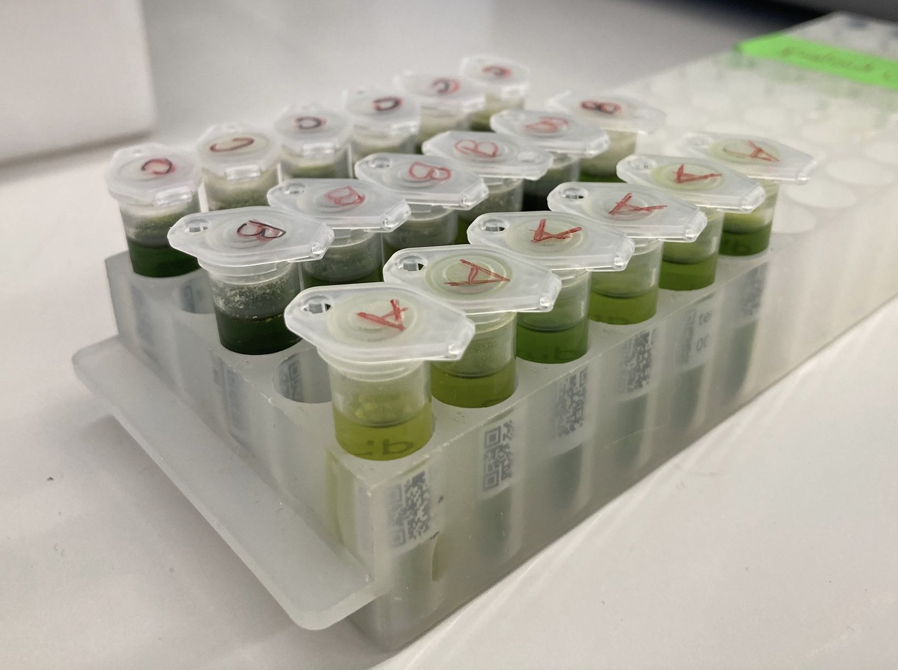

  

<strong>UNIVERSITY OF FRIBOURG</strong>

<strong>COMMONS LAB</strong>

<strong>DEPARTMENT OF BIOLOGY</strong>

  

<h1 align="center">
Geophytes collection, comparison of extraction solvents  
and modeling of data loss in mass spectrometry
</h1>

  

<em>Author :</em> <strong style="color:#800000">Jade Dandois</strong>&nbsp;&nbsp;&nbsp;&nbsp;&nbsp;&nbsp;&nbsp;&nbsp;<em>Supervisor :</em> <strong style="color:#800000">Dr. Pierre–Marie Allard</strong>

  

<strong>Submitted in fulfillment of the requirements for the Bachelor's degree.</strong>

<strong>June 27th, 2025</strong>

# Acknowledgements 

I would like to extend my heartfelt thanks to Pierre-Marie Allard, my professor and supervisor during these three months of academic work. I am deeply grateful for his unwavering dedication, his genuine interest in this remarkable project, and the invaluable guidance he has provided throughout. I hold great admiration for both his work and the inspiring project he initiated and continues to nurture with such commitment.

Thank you to the entire COMMONS LAB team. My warm thanks go to Héloïse Coen, who greatly supported me during the collection of geophytes and extraction processes—your help and our shared moments of collaboration were truly appreciated. Edouard Brülhart, thank you for patiently introducing me to the sampling techniques and the functioning of the laboratory. Colin Volet, for your guidance with the technical aspects of mass spectrometry, your expertise was essential. And finally, Marco Visani, for your remarkable patience and guidance in bioinformatics—thanks to you, I was able to significantly deepen my understanding of coding, an invaluable tool for the work I was entrusted with.

# Abstract 

--> à faire tout à la fin 

# Introduction 

A large number of databases are currently available to the public for biological elements such as proteins (UniProt, https://www.uniprot.org), RNA (Rfam, https://rfam.org/), DNA (NCBI GenBank, https://www.ncbi.nlm.nih.gov/genbank/) or genomes (Ensembl, https://www.ensembl.org/). 

However, the databases currently available for metabolomics  remain quite limited , focusing mainly on specific types of organism, such as humans (HMDB, https://www.hmdb.ca), for medical purposes and centered on known metabolites, or simply on raw analytical data (MassBank, https://massbank.eu/MassBank/). Another accessible database in metabolomics is the Global Natural Products Social Molecular Networking (GNPS), a collaborative platform for the processing and analysis of mass spectrometry data. GNPS includes both known metabolites and unknown metabolomic profiles (reference: Aron).

The Earth Metabolome Initiative (EMI) consortium, conceived in 2022 and formally launched in 2024 by Pierre-Marie Allard, is a collective open science endeavor aimed at addressing the critical lack of comprehensive metabolomic data. The initiative set out to build a database designed to profile the full spectrum of metabolites across all known living species—approximately 2.3 million—thus encompassing the entirety of life, from microbes to mammals, within an integrated and ecosystem-level perspective. Unlike existing databases, EMI stands out for its clear ambition to cover the full diversity of life across all kingdoms on a global scale. It focuses on the analysis of unknown metabolomic profiles from Earth’s organisms, while aiming to address gaps observed in existing resources such as GNPS, Massbank or HMDB. In particular, EMI sets itself apart by explicitly incorporating detailed metadata associated with the profiled organisms—an aspect that remains a notable limitation in GNPS.

## Earth Metabolome Initiative 

As mentioned above, the EMI consortium is an open science initiative with a global scope, whose aim is to draw up metabolomic profiles of all known species on this planet, with 3 main objectives, which are the protection of biodiversity, the benefit to human society and a deeper understanding of the chemical foundations of the biosphere. <a href="#ref1" id="note1">1</a>

Biodiversity is currently facing an unprecedented crisis, primarily driven by the intensification of human activities over the past century. This decline has accelerated dramatically in recent decades. Alarmingly, the current rate of species extinction is estimated to be at least 100 times higher than the natural background rate, underscoring the severity of human impact on the planet's ecosystems. <a href="#ref2" id="note2">2</a> 
In this context, acquiring comprehensive metabolic data becomes critically important. Such data can provide molecular-level insights into ecosystem functioning and the roles of natural products within them. By deepening our understanding of molecular diversity and its ecological relevance, we can develop informed strategies for conserving biodiversity and sustaining the natural resources upon which human well-being depends.

Establishing a comprehensive, publicly accessible database of species-specific metabolomic profiles is of paramount importance for advancing research across generations. Such a resource will provide open access to molecular-level data, facilitating a wide spectrum of scientific inquiry—from fundamental biological and biomedical research to the discovery of novel bioactive compounds and innovations in agri-food systems. By enabling a deeper understanding of natural metabolites that underpin ecosystem dynamics, nutritional quality, and agricultural resilience, this database will serve as a critical foundation for interdisciplinary efforts aimed at sustaining both human health and environmental integrity.

The establishment of a global metabolomic map by the Earth Metabolome Initiative (EMI) will also enable the integration of existing biological datasets with newly generated molecular data. This will facilitate the development of novel insights, such as evolutionary models of the metabolome, and may even allow for the prediction of the chemistry of yet-undiscovered organisms by identifying specific natural product patterns linked to molecular and ecological contexts.

This project is highly ambitious, and although a significant amount of data has already been collected, the establishment of a global metabolomic database is likely to take many years to fully materialize. For this reason, several pilot projects have been initiated to test data acquisition methodologies and to focus on specific components of the broader initiative, avoiding unnecessary dispersion.

Three of these EMI pilot projects formed the core of my bachelor's thesis and were specifically designed to address key objectives of the Earth Metabolome Initiative.

The first project falls within the scope of the Digital Botanical Gardens Initiative, a botanical-scale precursor to EMI, in which I participated by collecting samples from the geophyte section of the Fribourg Botanical Garden. The second project aimed to refine our extraction methods by comparing the currently used methanol-based solvent with dimethyl sulfoxide (DMSO), thereby improving the biocompatibility of our extracts for subsequent bioassays. The third project is part of the PhD research of Marco Visani and focuses on modeling molecular data loss in mass spectrometry, with the goal of predicting the chemistry of living organisms based on unknown natural extracts.

## Digital Botanical Gardens Initiative 

The Earth Metabolome Initiative (EMI) is a globally oriented project, and as such, required the development of a pilot version—a scaled-down implementation designed to be applied to nearby, easily accessible, and manipulable living organisms. The Digital Botanical Gardens Initiative was conceived precisely with this objective in mind. 

The initiative aims to digitize the chemical diversity of Swiss botanical gardens by creating extract libraries, analyzing them via mass spectrometry, and organizing the data into accessible, interoperable knowledge systems. It also seeks to develop scalable workflows and provide molecular insights to support biodiversity conservation and open science. 
These aspects of DGBI are fundamental for ensuring reproducibility of laboratory processes and facilitating automatisation, both of which are critical for the large-scale EMI project, which will handle millions of samples.

One of the key advantages offered by Swiss botanical gardens—particularly the Fribourg Botanical Garden, on which I focused my work—is the remarkable diversity they host; approximately 5,000 plant are cultivated and conserved there. Proximity is another crucial factor, as the garden is located within the University of Fribourg campus, providing immediate access to laboratories where analytical work is conducted. The plants are also highly convenient for experimental work: they are stationary, easy to sample in sufficient quantity, and accessible for repeated collections from the same individuals or locations when needed.

While the plants are cultivated rather than growing in their natural habitats—an aspect that may slightly influence their metabolic profiles—the primary objective here is not ecological fidelity, but rather the establishment of a solid reference framework. The garden setting provides an ideal platform for testing physical and bioinformatic tools involved in building a curated chemical library, and for evaluating the feasibility of a large-scale digitization project.

# Collection of Geophytes - Digital Botanical Gardens Initiative 

The current data from the Botanical Garden of the University of Fribourg record 1,679 collected plant species (42.7%), 1,250 species extracted beyond the core collection (31.8%), and 691 species for which metabolomic profiles have been generated (17.6%) https://emi-collection.unifr.ch/. While the garden conserves approximately 5,000 individual plants, these represent around 4,000 distinct species, as some are present in multiple specimens.

The harvest from the geophyte section proved particularly relevant, as this sector had not yet been covered by DGBI. Moreover, collecting additional data from this group contributed meaningfully to the advancement of the project.

Geophytes are perennial plants that exhibit resilience to both severe drought and extreme cold, primarily due to nutrient reserves stored in their underground organs (tubers, bulbs, rhizomes). These reserves enable them to enter a dormant state and persist in the soil until environmental conditions become favorable for growth. <a href="#ref3" id="note3">3</a>

*Figure 1 – Map of Fribourg botanical garden. The location of the geophyte sector is indicated by point number 10*

Several plant families were collected, including Amaryllidaceae, Liliaceae, Iridaceae and many others, enabling metabolomic patterns to be drawn up for these families, and for all geophyte-type plants.

With the help of Héloïse Coen, 185 samples were collected (including leaves and flowers samples) from 150 species. 128 species remain to be collected (46%), meaning that a substantial portion of the target species has already been covered for this part of the project. 

Below are the respective lists of samples collected by myself and Héloïse Coen, as well as the complete list of species in the geophyte section of the Fribourg Botanical Garden. 
[Geophytes collected by Jade Dandois](https://github.com/jade147/jade_bachelor_work_repo/blob/a4491cbe601b38fbaab3b5437008505f01ea06e1/field_data_trimmed.csv)
[Geophytes collected by Heloïse Coen](https://github.com/jade147/jade_bachelor_work_repo/blob/fe70e103e4634caacbb3a798a4f7b7fe4c3beaef/Field_Data%2020250618-12257.csv)
[Complete list of geophytes](https://github.com/jade147/jade_bachelor_work_repo/blob/fe70e103e4634caacbb3a798a4f7b7fe4c3beaef/geophytes_extrait.csv)

To cover this sector, a dedicated protocol for sample collection, extraction, and analysis was required.

## Materials and methods

### Collect 

The standard DBGI sampling protocol was followed throughout the collection process. Leaf or flower tissues were directly sampled from the target individual. Each specimen was placed in a coffee filter paper, inserted into a pre-labelled Falcon tube, and immediately flash-frozen in liquid nitrogen at -196 °C. Samples remained in liquid nitrogen until the end of the field session, after which they were stored at -80 °C pending lyophilization.

Each Falcon tube was pre-labelled with a unique QR code that links the sample to its associated metadata, selected via the QField application (https://qfield.org). For every collected sample, a georeferenced point was recorded on the QField map, accompanied by key identification data including precise location, taxon name, sample ID (matching the QR code), and a set of at least five descriptive photographs: (1) the species identification label, (2) the labelled Falcon tube next to the identification label, (3) a general view of the plant, (4) a close-up of key morphological features, and (5) a photo of the cutting site with the scalpel in place.

The QR code–linked identification key plays a critical role, providing a unique identifier for each sample and enabling efficient tracking of its metadata across all steps of the workflow—from collection to extraction and analysis. At each successive stage, the same QR code is transferred onto the resulting tube, with newly generated metadata—such as extracted weight, number of extractions, or storage container—systematically appended to the sample’s record.

### Extraction

Samples retrieved from the freezer were placed in a freeze-dryer for 72 hours. After lyophilization, they were transferred into Falcon tubes sealed with non-perforated caps. A mass of 50 milligrams of dried sample was weighed out, allowing for a tolerance of ±5% (±2.5 milligrams), and placed into 2 milliliters round-bottom Eppendorf tubes. Three 4 mm stainless steel beads were added to each tube to facilitate grinding of the extract. The remaining material was returned to its original Falcon tube and stored in a labeled container.

The weighed samples were ground using a Retsch shaker for 2.5 minutes at 25 Hz. Subsequently, 1.5 milliliters of the DGBI extraction solvent—composed of 80% methanol, 20% distilled water, and 0.1% formic acid—was added to each powdered sample. The tubes were shaken again in the Retsch machine under the same conditions (2.5 minutes at 25 Hz). Following this, the samples were centrifuged for 2 minutes at 13,000 RPM to separate the supernatant from residual plant debris. The supernatant was carefully collected and transferred into labeled vials (2 milliliters) equipped with hermetically sealed caps. These vials were then stored in labeled containers and kept at –80°C until further analysis.

### Aliquoting and analysis in mass spectrometry 

From the previously prepared vials, 120 microlitres of liquid extract were transferred into new vials equipped with inserts to create aliquots. The vials were carefully sealed using slipped caps. The resulting aliquots were then subjected to liquid chromatography–mass spectrometry (LC-MS), and the spectra were analyzed using appropriate tools and software (further details are provided in the subsequent sections of the project).

### Untargeted mass spectrometry 

* Figure 2 : Schematic representation of the sample analysis workflow using mass spectrometry.*
*The process includes separation via High-Performance Liquid Chromatography (HPLC), ionization and detection using an Orbitrap high-resolution mass analyzer, followed by Data-Dependent Acquisition (DDA) for MS/MS fragmentation. The diagram was created using MZmine, with parameters configured through the integrated mWizard assistant.*

--> préciser que c'est untargeted 
--> trouver un papier pour l'explication du processus + untargeted 

### Inaturalist 

Photographs associated with each collected species, taken during the field collection process, are uploaded to the iNaturalist platform (https://www.inaturalist.org/). This allows the iNaturalist community—including taxonomic experts—to verify species identities based on detailed images, and provides an opportunity to revise any incorrect or incomplete identifications. In turn, the community also benefits from these data, contributing to the ongoing expansion of the iNaturalist database. [The following map delineates the geographic range corresponding to the geolocated geophyte observations recorded on iNaturalist.](https://www.inaturalist.org/observations?nelat=46.79293526196035&nelng=7.156343175796218&subview=map&swlat=46.792731427890715&swlng=7.155914022353835&user_id=dbgi&verifiable=any)

## Conclusion and Perspectives 
 
Comme dit précédemment... regarder si les jardins botaniques des autres uni ont aussi été impliqués dans DBGI ou pas encore, et les mettre dans perspectives si c'est pas encore le cas. 
--> Regarder avec PMA 
--> attendre le mail de Neuchâtel 

# DMSO Project 

## Actual DBGI extraction and issues 

As outlined in the [introduction](#introduction), DGBI is a recent pilot project, one of whose objectives is to evaluate and refine current collection and extraction methodologies, with the aim of improving them where necessary.

One of the long-term objectives of both EMI and DGBI is to generate libraries of molecules obtained through sample extractions, with the aim of enabling their reuse and distribution to other laboratories for further bioanalysis, including high-throughput biological screening.

High-throughput screening (HTS) enables the automated testing of compound libraries to assess their activity against various biological targets. HTS is now extensively used in drug discovery, medical diagnostics, stem cell research, and genetic studies<a href="#ref4" id="note4">4</a>.

The extraction mixture currently used as a solvent for molecule extraction in the DGBI project consists of 80% methanol, 20% distilled water, and 0.1% formic acid, for a total volume of 200 mL. This composition has proven to be highly effective in extracting metabolites from our samples. However, the solvent currently used in the DGBI project for samples extraction is not compatible with downstream analyses in biological or biochemical laboratories, as methanol can damage cells and formic acid can inhibit enzymatic reactions.

## An alternative to methanol-based extraction 

Another solvent currently widely used in biology laboratories is dimethyl sulfoxide (DMSO), a highly stable, soluble, polar, aprotic, and low-toxicity compound, compatible with biological systems<a href="#ref5" id="note5">5</a>. These properties make DMSO an excellent solvent for biological applications.

Within this context, an additional pilot study was conducted to explore potential enhancements to both the extraction protocol and the solvent used. Specifically, three extraction methods were tested and compared to address the following question: is the extraction method using dimethyl sulfoxide (DMSO) as effective as the methanol-based protocol for recovering our target metabolites?

This study therefore aims to assess whether DMSO could serve as a suitable alternative to the current extraction mixture. If the results prove promising and DMSO performs as effectively as the methanol–water–formic acid mixture in extracting target molecules, it could be adopted in future protocols—thus enabling the reuse of extracted samples for pharmacological research purposes.

## Material and methods 

The [standard DBGI extraction protocol](#extraction) described above was followed for this pilot study, with the exception of the extraction solvent, which was modified for comparative purposes.

In this experiment, six well-documented plant samples (*Valeriana officinalis*, *Echinacea purpurea*, *Cannabis sativa*, *Erythroxylum coca*, *Salvia officinalis*, and *Nicotiana tabacum*) were tested using three extraction methods: the standard DBGI protocol with its usual solvent (80% methanol, 20% distilled water, 0.1% formic acid), a pure DMSO extraction (99.8%), and a DMSO extraction followed by sonication (5 minutes of high-frequency sound wave pulses generating bubbles that promote cell lysis).

For each method, one Eppendorf tube was prepared per sample. Two blanks were also included in the experiment, using the methanol-water-formic acid mixture and pure DMSO, respectively.

*Figure 3 : Eppendorf tubes after centrifugation with supernatant ready for recovery. The 6 samples per extraction method (A, B, C) are shown. A: Methanol-water-formic acid extraction method; B: Simple DMSO extraction; C: DMSO extraction with sonication.* 

The resulting 20 samples were then transferred to vials for mass spectrometry and subsequent analysis.

### Evaluation of extractions

The files generated from mass spectrometry analysis of the samples were processed using MZmine for the interpretation of the resulting chromatograms, applying the following mzBatch configuration : 

## Results 

As previously mentioned, the chromatograms of the samples tested using the three different methods were analyzed. However, given that the sonicated DMSO method did not yield significantly improved results compared to the simple DMSO extraction, only the chromatograms obtained from the methanol–water and simple DMSO methods are presented here for clarity.

Chromatographic profiles of extracts from the six species, obtained using methanol–water and DMSO extraction methods (represented by two colors), are superimposed to compare signal intensities and metabolic patterns as a function of retention time. The annotated peaks correspond to the majority compounds detected. 
For each species, data from both positive and negative ionization modes are displayed. A single blank chromatogram is included for each ionization mode, serving as a reference for both extraction methods. 
The annotated peaks correspond to the majority compounds detected. 

*Figure 4 : Positive ionization chromatograms obtained for Valeriana officinalis after extraction by two separate methods. 20250506_CVOL_dbgi_002560_02_01.mzML (magenta): methanol-water-formic acid method; 20250506_CVOL_dbgi_002560_03_01.mzML (blue): DMSO extraction method.*

*Figure 5 : Negative ionization chromatograms obtained for Valeriana officinalis after extraction by two separate methods. 20250506_CVOL_dbgi_002560_02_01_neg.mzML (green): methanol-water-formic acid method; 20250506_CVOL_dbgi_002560_03_01_neg.mzML (orange): DMSO extraction method.*

*Figure 6 : Positive ionization chromatograms obtained for Echinacea purpurea after extraction by two separate methods. 20250506_CVOL_dbgi_002976_02_01.mzML (magenta): methanol-water-formic acid method; 20250506_CVOL_dbgi_002976_03_01.mzML (blue): DMSO extraction method.*

*Figure 7 : Negative ionization chromatograms obtained for Echinacea purpurea after extraction by two separate methods. 20250506_CVOL_dbgi_002976_02_01_neg.mzML (green): methanol-water-formic acid method; 20250506_CVOL_dbgi_002976_03_01_neg.mzML (orange): DMSO extraction method.*

*Figure 8 : Positive ionization chromatograms obtained for Cannabis sativa after extraction by two separate methods. 20250506_CVOL_dbgi_002251_02_01.mzML (magenta): methanol-water-formic acid method; 20250506_CVOL_dbgi_002251_03_01.mzML (blue): DMSO extraction method.*

*Figure 9 : Negative ionization chromatograms obtained for Cannabis sativa after extraction by two separate methods. 20250506_CVOL_dbgi_002251_02_01_neg.mzML (green): methanol-water-formic acid method; 20250506_CVOL_dbgi_002251_03_01_neg.mzML (orange): DMSO extraction method.*

*Figure 10 : Positive ionization chromatograms obtained for Erythroxylum coca after extraction by two separate methods. 20250506_CVOL_dbqi_002893_02_01.mzML (magenta): methanol-water-formic acid method; 20250506_CVOL_dbqi_002893_03_01.mzML (blue): DMSO extraction method.*

*Figure 11 : Negative ionization chromatograms obtained for Erythroxylum coca after extraction by two separate methods. 20250506_CVOL_dbgi_002893_02_01_neq.mzML (green): methanol-water-formic acid method; 20250506_CVOL_dbgi002893_03_01_neg.mzML (orange): DMSO extraction method.*

*Figure 12 : Positive ionization chromatograms obtained for Salvia officinalis after extraction by two separate methods. 20250506_CVOL_dbgi_002605_02_01.mzML (magenta): methanol-water-formic acid method; 20250506_CVOL_dbgi_002605_03_01.mzML (blue): DMSO extraction method.*

*Figure 13 : Negative ionization chromatograms obtained for Salvia officinalis after extraction by two separate methods. 20250506_CVOL_dbgi_002605_02_01_neg.mzML (green): methanol-water-formic acid method; 20250506_CVOL_dbgi_002605_03_01_neg.mzML (orange): DMSO extraction method.*

*Figure 14 : Positive ionization chromatograms obtained for Nicotiana tabacum after extraction by two separate methods. 20250506_CVOL_dbgi_002414_02_01.mzML (magenta): methanol-water-formic acid method; 20250506_CVOL_dbgi_002414_03_01.mzML (blue): DMSO extraction method.*

*Figure 15 : Negative ionization chromatograms obtained for Nicotiana tabacum after extraction by two separate methods. 20250506 CVOL dbgi 002414 02 01 neg.mzML (green): methanol-water-formic acid method; 20250506_CVOL_dbgi_002414_03_01_neg.mzML (orange): DMSO extraction method.*

*Figure 16 : Positive ionization chromatograms obtained for the blank.20250506_CVOL_dbgi_bk_MeOH-H20_53.mzML (green): methanol-water-formic acid method; 20250506_CVOL_dbgi_bk_DMSO_58.mzML (yellow): DMSO extraction method.*

*Figure 17 : Negative ionization chromatograms obtained for the blank.20250506_CVOL_dbgi_bk_MeOH-H20_53_neg.mzML (blue): methanol-water-formic acid method; 20250506 CVOL dbgi bk DMSO 58 neg.mzML (red): DMSO extraction method.*

Comparative chromatograms of the two extraction methods show nearly superimposed results. In some cases, there are slight differences in detection; some peaks are better detected with the methanol extraction method, while others are better detected with the DMSO extraction method. Overall, the peaks are comparable and overlap with very high precision.

The comparative chromatograms differ according to the ionization mode, revealing that different molecules were detected in positive and negative ionization modes.

## Discussion and perspectives

Several notable differences were observed between samples extracted with dimethyl sulfoxide (DMSO) and those extracted with methanol. First, DMSO freezes at 19°C and is solid at -80°C, whereas methanol freezes at around -98°C and remains liquid at -80°C. Using DMSO as the extraction liquid requires additional thawing time, since samples can only be handled in the liquid phase. Furthermore, extracts obtained with DMSO foam after shaking and are significantly darker in color. However, almost all of the foam disappears during centrifugation. This enables the correct extraction of the supernatant without aspirating foam along with it.

*Figure 18 : Eppendorf tubes before centrifugation containing 2 extracts of Erythroxylum coca by 2 extraction methods; Left: DMSO extraction: Right: methanol-water-formic acid extraction.*

Sonication was employed in combination with DMSO for the third extraction method, as it enables the release of intracellular metabolites by lysing cell membranes. It relies on ultrasonic waves to generate bubbles in a liquid, which, upon implosion, produce high localized pressures and temperatures, thereby disrupting biological structures such as cellular membranes.

The initial hypothesis was that DMSO combined with sonication would yield mass spectrometry outputs of comparable quality to those obtained with methanol-based solvents, since sonication facilitates extensive cell disruption and maximizes compound recovery for analysis. However, sonicated DMSO produced results of similar—or even lower—quality than DMSO alone. This suggests, on one hand, that DMSO is highly effective as a standalone extraction solvent, and on the other hand, that combining sonication with DMSO may potentially damage biological structures beyond the cell membranes in our extracts. Further analyses or a reduction in sonication time could be considered for the protocol, to observe whether results are better, similar, or again of poorer quality.

### Conversion of libraries to 96-well format

In order to submit our natural product extracts to bioassay screening by external bioanalytical laboratories, it is essential to provide the samples in a format compatible with such analyses. To this end, we are currently reformatting our extract libraries in a 69-well configuration.

This reformatting step will be integrated with our ongoing results on DMSO-based extraction, thereby enabling us to refine our methodologies and improve sample compatibility for downstream bioassays and bioactive compound discovery.

The currently considered format for the 96-well libraries is the [AlteTube™ Screw Cap 2D Barcoded Tubes – External Thread – 96 SBS Rack](https://www.altemislab.com/2d-barcoded-tubes/external-thread-tubes-96-sbs-rack/). Further evaluation will determine its suitability for both our sample types and the subsequent bioanalytical workflows.

## Conclusion 

The comparison of chromatograms obtained from the two extraction methods enabled the evaluation of the compounds detected using both DMSO- and methanol-based protocols. The results are highly promising: the near-perfect overlap of peaks indicates that simple DMSO extraction is as effective as the conventional methanol/water/formic acid mixture in recovering the molecules in our extracts. This finding opens the possibility of replacing the current solvent with DMSO in the extraction protocol. Combined with a 96-well format, this approach would allow for the reuse of extracted samples in high-throughput screening and facilitate the sharing of these extracts with other laboratories for bioactive compound discovery, thus aligning with one of EMI’s key objectives.

# Fake extract project 

--> Revoir la définition avec le projet lotus. 

One of the long-term goals of the Earth Metabolome Initiative (EMI) is to predict the yet unexplored chemistry of life on Earth. At present, when a natural extract is subjected to untargeted mass spectrometry, the resulting molecular profile does not allow us to determine with certainty whether certain compounds were lost during the process. Indeed, ionization in mass spectrometry is inherently competitive: only molecules with favorable physicochemical properties—such as polarity, basicity, acidity, molecular weight, or structural features—ionize efficiently. Others may be significantly disadvantaged by phenomena such as ion suppression<a href="#ref6" id="note6">6</a>, leading to a reduced or even absent signal in complex natural mixtures.

To model these losses and anticipate the missing chemistry within natural extracts, we designed the *Fake Extract Project*. This approach relies on the analysis of an artificial mixture composed of 89 well-characterized reference compounds, processed through mass spectrometry. By comparing the output signal to the known initial composition, it becomes possible to quantify compound-specific detection losses. This strategy allows for the calibration and correction of experimental outputs by accounting for ionization biases, with the ultimate aim of more faithfully approximating the complete chemical composition of natural extracts.

## Bibliothèque de produits naturels ApexBio

En premier lieu, l'utilisation d'une plante modèle bien caractérisée de la biologie végétale a été envisagée, telle que Arabidopsis thaliana. Cependant, .. 

## Material and methods 

--> détailler les dilutions et les puits (A1, B2, ...)
--> 2 transfert consécutifs avec la multipipette 
--> dilution 1 pour le mix 
--> dilution 2 pour les molécules individuelles 

### Data cleaning with python 

--> Mentionner la classe et le code intéressant 
--> inclure les 3 csv 
--> inclure la plaque 3 qui a été choisie comme pilote 

### Chromatographie en phase liquide 

--> comme en haut, mais préciser que c'est targeted 

## Results 

--> inclure le diagramme de Venn 
--> que le mix ou pics individuels aussi ? 
--> en méthode, que expliquer la spectrométrie de masse ou aussi les settings sur mzmine ? (Marco a fait et juste envoyé les résultats, j'ai pas les settings)

## Discussions 

## Conclusion and perspectives 

# Bibliography 

1. : Allard, P.-M. (2023). The Digital Botanical Gardens Initiative repository. https://doi.org/10.5281/zenodo.7662428 

2. : Shivanna, K. R. (2020). The Sixth Mass Extinction Crisis and its Impact on Biodiversity and Human Welfare. Resonance, 25(1), 93–109. https://doi.org/10.1007/s12045-019-0924-z 

3. : Tribble, C. M., Martínez-Gómez, J., Howard, C. C., Males, J., Sosa, V., Sessa, E. B., Cellinese, N., & Specht, C. D. (2021). Get the shovel: morphological and evolutionary complexities of belowground organs in geophytes. In American Journal of Botany (Vol. 108, Issue 3, pp. 372–387). John Wiley and Sons Inc. https://doi.org/10.1002/ajb2.1623

4. :Rodríguez-Dévora, J. I., Shi, Z. D., & Xu, T. (2011). Direct assembling methodologies for high-throughput bioscreening. In Biotechnology Journal (Vol. 6, Issue 12, pp. 1454–1465). https://doi.org/10.1002/biot.201100100 

5. : Balakin, K. v., Ivanenkov, Y. A., Skorenko, A. v., Nikolsky, Y. v., Savchuk, N. P., & Ivashchenko, A. A. (2004). In silico estimation of DMSO solubility of organic compounds for bioscreening. Journal of Biomolecular Screening, 9(1), 22–31. https://doi.org/10.1177/1087057103260006

6. : Annesley, T. M. (2003). Ion Suppression in Mass Spectrometry. Clinical Chemistry, 49(7), 1041–1044. https://doi.org/10.1373/49.7.1041

Aron, A. T., Gentry, E. C., McPhail, K. L., Nothias, L. F., Nothias-Esposito, M., Bouslimani, A., Petras, D., Gauglitz, J. M., Sikora, N., Vargas, F., van der Hooft, J. J. J., Ernst, M., Kang, K. bin, Aceves, C. M., Caraballo-Rodríguez, A. M., Koester, I., Weldon, K. C., Bertrand, S., Roullier, C., … Dorrestein, P. C. (2020). Reproducible molecular networking of untargeted mass spectrometry data using GNPS. Nature Protocols, 15(6), 1954–1991. https://doi.org/10.1038/s41596-020-0317-5

Sonication: définition, principe, exemples d'applications. SinapTec, www.sinaptec.fr/sonication-definition-principe-exemples/. Accessed 25 June 2025.
