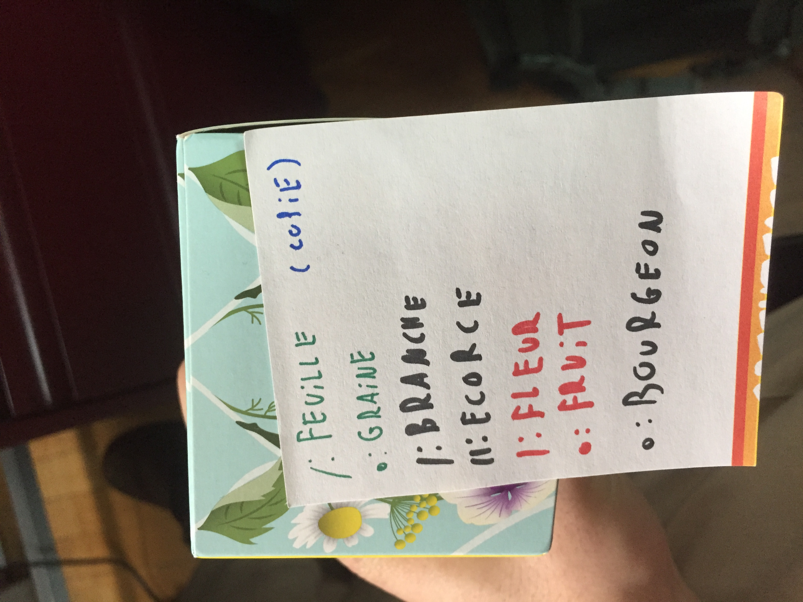

# This is Simon's COMMONS Lab daily Open Notebook.

Today is 2025.03.26

## Todo today
Continuing with the research of a definition for "tree":
Selon "Le glossaire illustré pour la botanique de terrain" de Kozlowski, un arbre est une "Plante ligneuse possédant un tronc (ce qui sépare les racines du houppier) et une couronne (nécessite des branches), de grande taille (généralement plus de 7m lorsqu'il est âgé)

Un arbrisseau est une "Plante ligneuse sans tige principale (tronc), ramifié dès sa souche. Les bourgeons apparaissant à la base de la plante engendrent de nouvelles tiges tout au long de sa vie. Mesure souvent moins de 4m"

Arbuste: "Plante ligneuse possédant généralement un tron (contrairement à l'arbrisseau, qui est ramifié dès sa souche) et mesurant jusqu'à 7m de hauteur, à morphologie intermédiaire entre l'arbre et l'arbrisseau
Cf. tableau 33 du bouquin

Die Wald- und Parkbäume Europas : ein Bestimmungsbuch für Dendrologen und Naturfreunde
Mitchell, Alan (créateur_trice)
Hamburg [etc.] : P. Parey
[1975]; © 1975
"Ein Baum ist eine holzige, ausdauernde Pflanze, die wenigstens eine Höhe von etwa 6m erreicht; der Stamm kann sich schon sehr weit unten verzweigen, jedoch mus dies oberhalb des Bodens erfolgen. Soweit die Definition. In diesem Werk wurden Gattungen dann vollständig, d.h. mit allen wichtigen Arten, aufgenomzählt. So gehört der Weissdorn hierher, obwohl er hierzulande fast stet als niedriger, vielstämmiger Strauch zu sehen ist. Es gibt von ihm nämlich einige Arten, die über 10m hoch werden. Die Hasel stellt einen Grenzfall dar, während Holunder und Hartiriegl einwandfrei.
Diese Definition trifft für einige Kultivare (Sorten) von Koniferen nicht zu. Wenn diese trotzdem aufgenommen wurden, so deshalb, weil sie Formen "echter" Bäume darstellen und aus diesem Grunde dazu gehören."
In english:
"A tree is a woody, perennial plant that reaches a height of at least about 6 metres; the trunk can branch very far down, but this must be above the ground. So much for the definition. In this work, genera were then listed in full, i.e. with all important species. Hawthorn, for example, belongs here, although in this country it is almost always seen as a low, multi-stemmed shrub. There are some species of hawthorn that grow to over 10 metres in height. The hazel is a borderline case, while the elderberry and the dogwood are perfect.
This definition does not apply to some cultivars (varieties) of conifers. If these are included anyway, it is because they are forms of ‘real’ trees and therefore belong here."
Translated with DeepL.com (free version)

As there are no universal description of what a tree is, I will propose a first definition for this bachelor work.
A plant referred to as a tree is perennial, is lignified, has a trunk. Encompasses palms, cycadales, conifers, arbres standards, bonsais. But excludes banana trees, papaya trees, shrubs

https://doi.org/10.1016/j.cub.2007.01.041:
It is quite philosophical as there is a general idea of what a tree is, but no clear botanical description. We could say that "tree" refers to the classical oak style plant. But tree-like growth forms appeared more than once in the evolution of land plants (lepidodendron, ferns, sphenopsides calamites, seed plants), different emergences in monocotyledons (dragon trees, palms)

Definitions of 'tree' and 'shrub'
September 2015
DOI:10.13140/RG.2.1.4103.9848:
Au moins 249 définitions différentes du mot "arbre" et 23 de "buisson"
Varie selon le domaine, l'Etat, la loi
Eléments qui reviennent: plante pérenne, tige(s) avec ramification au bout, ligneux, grande taille

Séparation arbre/buisson semble pour le moins arbitraire

Arbre vient du latin "arbor" (https://www.littre.org/definition/arbre) et qui veut dire "arbre" (https://en.wiktionary.org/wiki/arbor)

### Have a look at the COMMONS research discussion forum
    - https://github.com/orgs/commons-research/discussions

###
###

## Doing
I forgot to do yesterday's log. So here it is.
The sampling of trees finally started (yay!).
It is regular sampling, but an additionnal picture of the specimen QR-code must be taken and added to the comment section of the second "onglet" (maybe ecological metadata?).
I made a sign code () to determine which organs have already been collected and what's left to sample. A will post a picture of it if I remember to.
However, the category bark, and maybe branch are missing. Maybe the branch category is redundant, as a branch is a secondary stem. We will see.
I should ask Edouard to add them if possible.

## Paused

## Done

## Notes

## Todo tomorrow, one day ... or never 
[]Ask Edouard to add the categories "bark", and "branch" to the sample type.
[] Demander à Kozlowski ce qu'il pense ce qu'est un arbre

###
###

## Today I learned that

- 