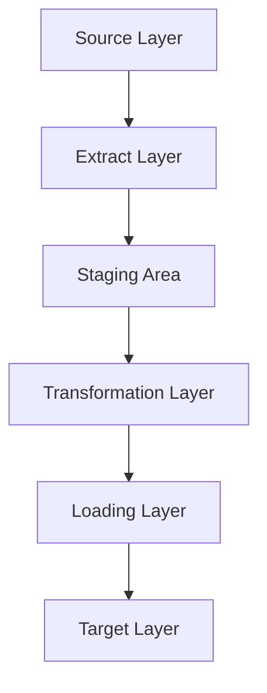

# [ETL (Wikipedia)](https://en.wikipedia.org/wiki/Extract,_transform,_load)
## Terms:
- ETL: Extract Transform Load - three phase computing process where data is extracted, transformed, and loaded into an output format.
- [data warehousing](https://en.wikipedia.org/wiki/Data_warehouse): DW - system that is used for reporting and data analysis for things like business intelligence
- [surrogate key](https://en.wikipedia.org/wiki/Surrogate_key): aka synthetic key, pseudokey, entity identifier, factless key, technical key - unique identifier for an entity or an object. 

ETL should validate and enforce data types, validate data standards, and conform to output requirements. Data is cleaned then transformed. Finally it is usually inserted into a database as the output. 

Commonly used in cloud based data warehousing. 
## Phases
### Extract
Extraction must be done correctly from the source, or it will impact the output data quality. Data source formats can include dbs, flat file dbs, xml, json, etc. Data validation is done at this step, and ensuring values are expected for the specified domain (pattern/default values or list of values available). Data may be rejected entirely or partially. 
### Transform
Here specified rules are applied to the data to prepare it. Transformations may include:
1) selecting columns to load
2) translating values (1 to female and 2 to male etc)
3) Encoding free-form values (male to M)
4) Deriving a calculated value
5) sorting/ordering data
6) joining data from multiple sources and deduplication of data
7) aggregation. e.g. summarizing multiple rows of data
8) generate surrogate-key values
9) Transposing or pivoting columns to rows or vice versa
10) Splitting columns up as needed, such as a list of values
11) disaggregating repeating columns
12) validating data from reference tables/files
13) applying data validation rules
### Load
Loads the data into the target output. 

# [ETL Pipeline (geeksforgeeks)](https://www.geeksforgeeks.org/software-testing/what-is-an-etl-pipeline/)
Extract data from multiple sources, transform and clean it, then load it into a target system (e.g. data warehouse). steps:
- extract data from sources 
- transform data by cleaning, filtering, otherwise extracting
- load processed data into storage system
## Process of ETL
Extract, Transform, Load
## ETL Architecture

- Source layer: data originates here
- extraction layer: data extracted from source systems
- staging area: temporary storage area where extracted data is stored
- transformation layer: data is cleaned, filtered, joined, and converted to structured format
- loading layer: data is loaded into target system
- target layer: destination, where the data resides for analysis and decision making. 
## Types of ETL Pipelines
- batch ETL pipeline: data is collected and processed on intervalls
- real-time ETL pipeline: data processed continuously as it is generated
- micro-batch ETL pipeline: processed in small batches on short intervals (seconds or minutes)
- Cloud-based ETL pipelne; data is processed using cloud platforms and services
- Streaming ETL pipeline: data flows continuously from sources, such as IoT devices. 
## Benefits of ETL Pipelines
- centralizes and standardizes data
- allwos focusing on important tasks
- migrating data
- enables deeper analytics 

