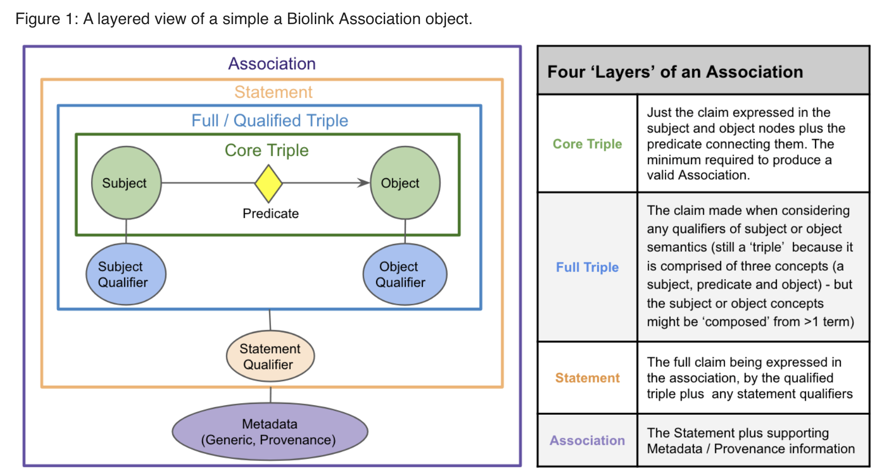
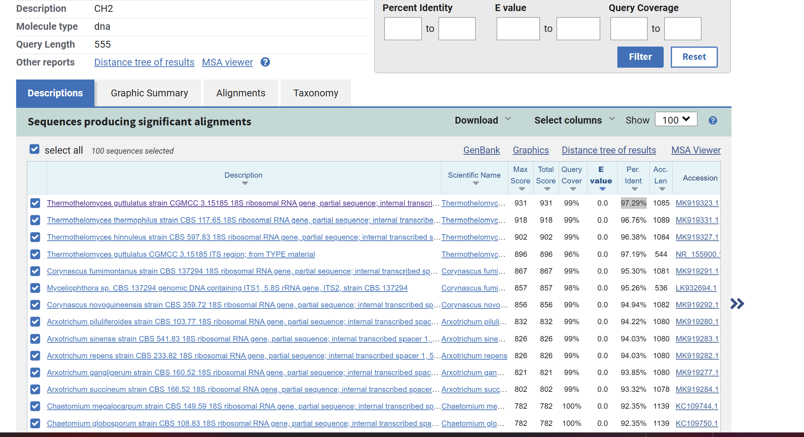
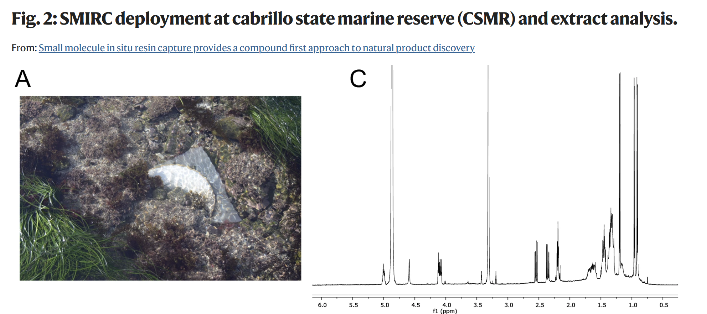
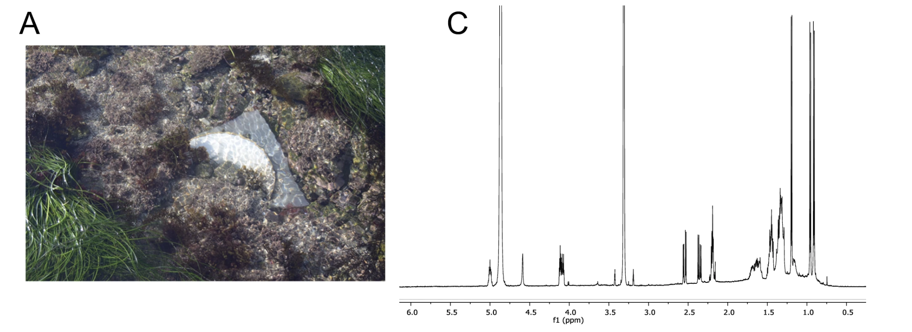

# This is Rimas's COMMONS Lab daily Open Notebook.

Today is 2023.10.11

## Todo today
Getting started with Dandron with PMA

### Have a look at the COMMONS research discussion forum
    - https://github.com/orgs/commons-research/discussions

### Daily work on the Microcosmics project

See [[projects.commons-public.microcosmics]]

### Lab work 

09-10-23

I carried out the first sampling at the botanical garden. I took a horizon of 3- 12 cm.
See pic [[]]
[[]]
[[]]

10-10-2023 Check the inoculated plates.  

Look pic [[]]
[[]]
[[]]
[[]]

###

## Doing

Working on the eerimental design off the roject.
Collecting infos and pdf and woring at [[projects.commons-public.microcosmics.experimental-design]]. 

## Paused

## Done

How to write note in Dendron and to sync with public commons web.

## Notes

## Todo tomorrow, one day ... or never 

###
###

## Today I learned that

- using ctrl+O+N i can creat a dialy note 
- ctrl+s to save my modification  
- ctrl+L search or create note 
- share picture [[link]]
ctrl+shift+P show pallette

#### Setting up of the Microcosmics project 

### Literature 

### Experimental design of microcosmics project 

Materials and Methods

I. Preliminary microcosm optimization step

A. Preparation of Microcosms
We do not have data on the lab's microcosm resistance duration. Therefore, we have created three different batches of 200 grams of soil. The first batch (control) consists of soil sterilized in an autoclave at 121 °C for one hour. The second microcosm, called the natural microcosm, underwent no modifications. The last type is the microcosm enriched with a mineral solution to maintain the basic metabolism of the microcosm and promote the growth of slow-growing microorganisms, as shown in the experimental plan in Figure 1. Each of these three types of microcosms will be replicated four times, giving us a total of twelve microcosms for measurements after 1 week, 15 days, 21 days, and 30 days. All microcosms were incubated at 28 °C. All components used for the microcosms were sterilized in an autoclave for 30 minutes at 121 °C.

**B. Screening of extraction methods
In the first step, we optimized the soil metabolome extraction protocol. To achieve this, we extracted 5 grams of soil using five extraction methods: M1, M2, M3, M4, and M5. Subsequently, the mixtures were allowed to rest for 2 hours, after which they underwent sonication at 37 kHz with a 100-pulse wave for 30 minutes at a temperature range of 30-60°C. Following this, the samples were centrifuged at 20,000× g for 15 minutes at 4°C. The supernatants were collected and stored at -20°C for further analysis.
Method 1: 100% methanol.
Method 2: 80%,20%, 0.01% (Methanol/ H2O/Formic acid).
Method 3: 100% DMSO.
Method 4: 4ml of ammonium bicarbonate + 10 ml methanol+ 5ml of chloroform.
Method 5: 4ml of ammonium bicarbonate + 10 ml ethyl acetate.
All the extractions have a final volume of 15 ml with 5 g of soil.
Additionally, 0.5 grams of the sample were diluted in 4 milliliters of sterile distilled water and vigorously shaken. A volume of 100 μL of the diluted sample was inoculated onto various culture media, including SCA supplemented with antimicrobials (nalidixic acid, cycloheximide, and nystatin), PDA, nutrient agar, and A4. The plates were incubated at 28°C, except for those inoculated on nutrient agar, which were incubated at 37°C.

### you have to do tomorrow 

1. Prepare blanks for LC-MS analysis.
2. check plates. 
3. looking for a protocol to manipulate ecoplate

### Rima note 12-10-23

# I learned how to share image with Dendronn
ctrl+shift+p 

### Done 
praparation of blancks for LC-MS analysis 
boites checked 

