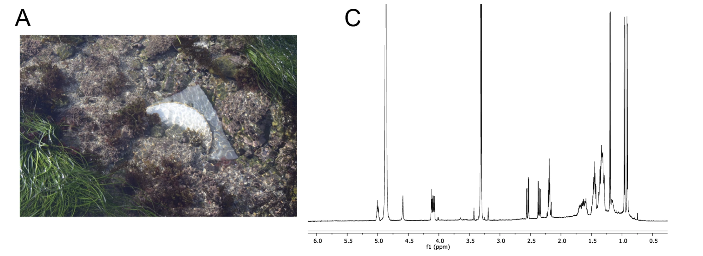

# This is Rimas's COMMONS Lab daily Open Notebook.

Today is 2024.11.26

## Todo today
- Isolation of new strains.
- Prepare meniral media.
- Preparation of SCA. 
- Read how to isolate endophytic actinobacteria. 

### Have a look at the COMMONS research discussion forum
    - https://github.com/orgs/commons-research/discussions

### Daily work on the Microcosmics project

See [[projects.commons-public.microcosmics]]

###
###

## Doing
Goog paper: describe a compound-first approach to natural product discovery in which adsorbent resins capture compounds directly from the environments in which they are produced. Using this technique, which we call SMIRC, natural products were captured and purified from a marine deployment site in sufficient quantities to elucidate the structures of cabrillostatin (1) and the halogenated polyketides cabrillospirals A and B (2-3), which represent two new carbon skeletons 

## 

## Done

## Notes

## Todo tomorrow, one day ... or never 

###
###

## Today I learned that

- 