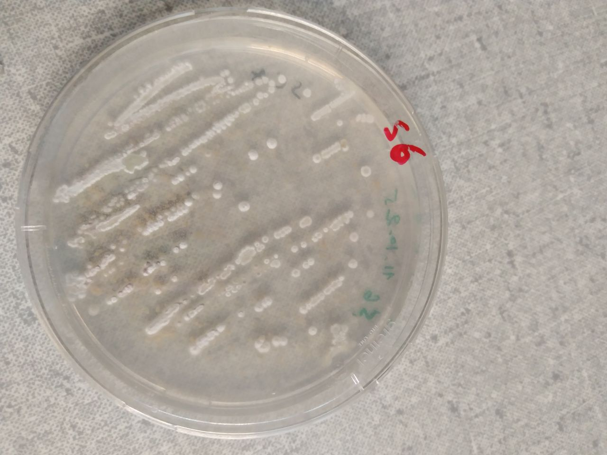

The followoing strains have been identified through their 16RNA sequencing data.

## Streptomyces lusitanus

WD query for compounds https://w.wiki/BfHS
#wd 

More info in the related note [[projects.commons-public.microcosmics.strains.Streptomyces lusitanus]]

## Streptomyces xanthophaeus

WD query for compounds https://w.wiki/BfHN
https://scholia.toolforge.org/taxon/Q26293525#metabolome

## Paecilomyces lilacinus

WD query for compounds https://w.wiki/BfHT
Not to be worked on.
Human pathogen.

## 16S DNA sequences 
>S3
AAGTCGAACGATGAACCACTTCGGTGGGGATTAGTGGCGAACGGGTGAGTAACACGTGGGCAATCTGCCCTGCACTCTGGGACAAGCCCTGGAAACGGGGTCTAATACCGGATACTGATCGCCTTGGGCATCCTTGGTGATCGAAAGCTCCGGCGGTGCAGGATGAGCCCGCGGCCTATCAGCTTGTTGGTGAGGTAATGGCTCACCAAGGCGACGACGGGTAGCCGGCCTGAGAGGGCGACCGGCCACACTGGGACTGAGACACGGCCCAGACTCCTACGGGAGGCAGCAGTGGGGAATATTGCACAATGGGCGAAAGCCTGATGCAGCGACGCCGCGTGAGGGATGACGGCCTTCGGGTTGTAAACCTCTTTCAGCAGGGAAGAAGCGAAAGTGACGGTACCTGCAGAAGAAGCGCCGGCTAACTACGTGCCAGCAGCCGCGGTAATACGTAGGGCGCGAGCGTTGTCCGGAATTATTGGGCGTAAAGAGCTCGTAGGCGGCTTGTCGCGTCGGTTGTGAAAGCCCGGGGCTTAACCCCGGGTCTGCAGTCGATACGGGCAGGCTAGAGTTCGGTAGGGGAGATCGGAATTCCTGGTGTAGCGGTGAAATGCGCAGATATCAGGAGGAACACCGGTGGCGAAGGCGGATCTCTGGGCCGATACTGACGCTGAGGAGCGAAAGCGTGGGGAGCGAACAGGATTAGATACCCTGGTAGTCCACGCCGTAAACGGTGGGCACTAGGTGTGGGCGACATTCCACGTCGTCCGTGCCGCAGCTAACGCATTAAGTGCCCCGCCTGGGGAGTACGGCCGCAAGGCTAAAACTCAAAGGAATTGACGGGGGCCCGCACAAGCGGCGGAGCATGTGGCTTAATTCGACGCAACGCGAAGAACCTTACCAAGGCTTGACATACACCGGAAACGCCCGGAGATGGGCGCCCCTTGTGGTCGGAGTACAGGTGGTGCATGGCTGTCGTCAGCTCGTGTCGTGAGATGTTGGGTTAAGTCCCGCAACGAGCGCACCCTTGTCCCGTGTTGCCAGCAGGCCCTTGGGGTGCTGGGAATCACGGGAGACCGCCGGGGTCAATCGGAGGAAGGGGGG
>S6
ATGCAGTCGAACGATGAAGCCCTTCGGGGTGGATTAGTGGCGAACGGGTGAGTAACACGTGGGCAATCTGCCCTTCACTCTGGGACAAGCCCTGGAAACGGGGTCTAATACCGGATACCACTCCTGCCTGCATGGGCGGGGGTTGAAAGCTCCGGCGGTGAAGGATGAGCCCGCGGCCTATCAGCTTGTTGGTGGGGTAATGGCCCACCAAGGCGACGACGGGTAGCCGGCCTGAGAGGGCGACCGGCCACACTGGGACTGAGACACGGCCCAGACTCCTACGGGAGGCAGCAGTGGGGAATATTGCACAATGGGCGAAAGCCTGATGCAGCGACGCCGCGTGAGGGATGACGGCCTTCGGGTTGTAAACCTCTTTCAGCAGGGAAGAAGCGAAAGTGACGGTACCTGCAGAAGAAGCGCCGGCTAACTACGTGCCAGCAGCCGCGGTAATACGTAGGGCGCAAGCGTTGTCCGGAATTATTGGGCGTAAAGAGCTCGTAGGCGGCTTGTCACGTCGGATGTGAAAGCCCGAGGCTTAACCTCGGGTCTGCATTCGATACGGGCTAGCTAGAGTGTGGTAGGGGAGATCGGAATTCCTGGTGTAGCGGTGAAATGCGCAGATATCAGGAGGAACACCGGTGGCGAAGGCGGATCTCTGGGCCATTACTGACGCTGAGGAGCGAAAGCGTGGGGAGCGAACAGGATTAGATACCCTGGTAGTCCACGCCGTAAACGTTGGGAACTAGGTGTTGGCGACATTCCACGTCGTCGGTGCCGCAGCTAACGCATTAAGTTCCCCGCCTGGGGAGTACGGCCGCAAGGCTAAAACTCAAAGGAATTGACGGGGGCCCGCACAAGCGGCGGAGCATGTGGCTTAATTCGACGCAACGCGAAGAACCTTACCAAGGCTTGACATATACCGGAAAGCATTAGAGATAGTGCCCCCCTTGTGGTCGGTATACAGGTGGTGCATGGCTGTCGTCAGCTCGTGTCGTGAGATGTTGGGTTAAGTCCCGCAACGAGCGCAACCCTTGTCCTGTGTTGCCAGCATGCCCTTCGGGGTGATGGGGACTCACAGGAGACCGCCGGGGTCAACTCGGAGGAGGTGGGGACGACGTCAGTCATCATGCCCCTTAG
## ITS Fungi sequences 
>CH6
AGCGGAGGGATCATTACCGAGTTATACAACTCCCAAACCCACTGTGAACCTTACCTCAGTTGCCTCGGCGGGAACGCCCCGGCCGCCTGCCCCCGCGCCGGCGCCGGACCCAGGCGCCCGCCGCAGGGACCCCAAACTCTCTTGCATTACGCCCAGCGGGCGGAATTTCTTCTCTGAGTTGCACAAGCAAAAACAAATGAATCAAAACTTTCAACAACGGATCTCTTGGTTCTGGCATCGATGAAGAACGCAGCGAAATGCGATAAGTAATGTGAATTGCAGAATTCAGTGAATCATCGAATCTTTGAACGCACATTGCGCCCGCCAGCATTCTGGCGGGCATGCCTGTTCGAGCGTCATTTCAACCCTCGAGCCCCCCCCGGGGGCCTCGGTGTTGGGGGACGGCACACCAGCCGCCCCCGAAATGCAGTGGCGACCCCGCCGCAGCCTCCCCTGCGTAGTAGCACACACCTCGCACCGGAGCGCGGAGGCGGTCACGCCGTAAAACGCCCAACTTTCTTAGAGTTGACCTCGGATCAGGTAGGAATACCCGCTGAACTTAAGCATATCAATAAGCGGAGGAA

##  DNA Protocol extraction 
PCR PROTOCOL FOR Actinomycetes
DNA extraction (heat shock method):
1.	Take bacterial mycelium in a clean 1.5 mL Eppendorf tube.
2.	Grind the cells using a clean tip and suspend them thoroughly in 1 mL of distilled water. 
3.	Heat the samples at 95°C in the heating block for 20 min.
4.	Transfer the tube (suddenly) to ice for 10 min. 
5.	Re-heat the sample in the heating block at 95°C for 10 min.
6.	Store DNA at -20°C.

16S rDNA Primers:
•	27F and 1492R
27F: 5’-AGAGTTTGATCCTGGCTCAG-3’
1492R: 5’-CGGTTACCTTGTTACGACTT-3’
(A)	 PCR amplification in 25 μl of reaction (Accustart II):
•	5 μL of genomic DNA 
•	0.5 μL of primer F (25 μM)
•	0.5 μL of primer R (25 μM)
•	12.5 μL of Accustart II PCR toughmix (2x)
•	0.5 μL of gel track loading Dye (50X)
•	6 μL of water

(B)	PCR amplification in 25 μl of reaction (Solifast):
•	5 μL of genomic DNA
•	0.5 μL of primer F (25 μM)
•	0.5 μL of primer R (25 μM)
•	5 μL of Solifast (5x)
•	14 μL of water

Amplification conditions: 
•	Initial denaturation at 94°C for 3 min
•	Followed by 35 cycles of
1.	a denaturation step at 94°C for 30 s,
2.	an annealing step at 56°C for 30 s, and
3.	an extension step at 72°C for 1 min 40 s,
•	Followed by a final extension step at 72°C for 10 min.

Gel electrophoresis:
1.	Prepare 1% agarose: 1g agarose in 100 mL of 1X TAE buffer (40 mol/L Tris-acetate, and 1 mM EDTA, pH 8.0). (0.6 g in 60 mL for small trays)
2.	Stain the gel with 6 μl of GreenSafe solution (3 for 60 mL).
3.	Immerse the gel in 1X TAE (pH 8.0) buffer.
4.	Load the prepared PCR products into the wells. 
5.	 Use a 1 Kbp-DNA ladder as a molecular weight marker. 
6.	Pass 100 volts of electric current through the gel for 30 min.
7.	Remove and visualize the gel, in a Trans illumination cabinet.
8.	Capture the image using a gel documentation system. 

•	Appearance of the target band specified for the primer set on the agarose gel is considered as a positive amplification product.

## Strains picture 
CH6

S3

S6

CH4

V1

## To do next week
1- Saturday culture bacteria 
1- run LC-MS for vials soil 
2- ITS extraction of CH4, CH2, V1

